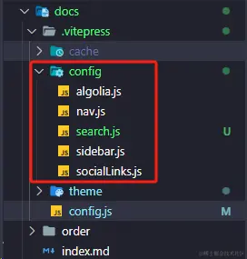

# Blob

## VitePress是什么

在搭建博客之前,我们先做一下准备工作, 了解一下VitePress是个什么东东。VitePress是由Vue + vite支持的静态站点生成器，我们看到他是由基于Vue框架构建的，因为Vue使用起来不难，所以VitePress使用起来也很简单；并且它还是基于vite的，那么代表我们可以享受到Vite带来的开发体验！VitePress灵感来源于VuePress，现在VuePress2也支持了Vue3和Vite，但是官方由于开发精力有限决定把重心放到VitePress上，所以我们选择VitePress来进行博客搭建。

## 步骤

### 安装node.js

> 官网地址：[nodejs.org/zh-cn](https://link.juejin.cn/?target=https%3A%2F%2Fnodejs.org%2Fzh-cn "https://nodejs.org/zh-cn")

> 一旦成功下载和安装了Node.js，您就可以使用npm命令了。npm是Node.js的包管理器，用于安装、管理和发布JavaScript软件包。
>
> 要使用npm命令，请按照以下步骤操作：
>
> 1. 打开终端（Terminal）应用程序。
> 2. 输入以下命令，检查Node.js和npm是否正确安装：
>
> node -v
>
> npm -v
>
> 这将显示您安装的Node.js和npm的版本号。如果显示版本号，则说明安装成功。

#### 配置全局安装路径

```shell
 # 创建文件夹
 mkdir -p /Users/jiangbolun/Home/npm
 
 
 # 将全局安装的软件包放置在文件夹下
 npm config set prefix /Users/jiangbolun/Home/npm
 
 
 # 将npm的bin目录添加到系统的PATH环境变量中
 sudo vim ~/.bash_profile
 
 # 最下面加命令
 # npm
 export PATH=/Users/jiangbolun/Home/npm/bin:$PATH
 
 # 生效
 source ~/.bash_profile
 
 # 验证
 npm config get prefix
```

#### 切换npm的淘宝镜像

```shell
 npm config set registry https://registry.npmmirror.com
```

#### 安装 pnpm

```shell
 # 安装 pnpm
 npm install -g pnpm
# -g 代表 global
 
 # 换源
 pnpm set registry https://registry.npmmirror.com

# 验证
pnpm -v

# 如果总遇到 pnpm not found
sudo vim .zshrc
# 最下面加一行
source ~/.bash_profile
# 保存退出后 source一把
source .zshrc
```

### 项目搭建

> [VitePress 中文文档地址](https://vitejs.cn/vitepress/guide/getting-started.html "https://vitejs.cn/vitepress/guide/getting-started.html")

#### github 新建仓库，clone到本地

‍

#### 初始化 VitePress

```shell
 # 初始化
 pnpm init
 
 
 # 安装需要的依赖
 pnpm i vitepress vue

# 初始化vitepress项目向导
pnpm vitepress init
 

## 将需要回答几个简单的问题

┌  Welcome to VitePress!
│
◇  Where should VitePress initialize the config?（vitepress主要文件夹）
│  ./docs
│
◇  Site title:（站点标签的标题）
│  My Awesome Project
│
◇  Site description:（站点主页的描述）
│  A VitePress Site
│
◆  Theme:（可选的主题。这里我选第二个：默认的主题+可定制的）
│  ○ Default Theme (Out of the box, good-looking docs)
│  ● Default Theme + Customization
│  ○ Custom Theme

 
 # 启动服务 (在本地运行项目vitepress会在http://localhost:5173/启动一个热更新的开发服务器)
 pnpm docs:dev
```

#### 配置VitePress

##### 文件结构

```bash
.
├─ docs
│  ├─ .vitepress
      ├─ theme # 自定义主题目录
         ├─ index.ts
         └─ style.css
│  │  └─ config.mts # 文档首页的概览、导航栏、侧边栏、链接、文字等等主题配置
│  ├─ api-examples.md # 默认的API示例使用文档
│  ├─ markdown-examples.md # 默认的markdown示例文档
│  └─ index.md  # 文档的首页
└─ package.json

```

##### config.js 配置

> 为了方便，我们不使用ts，把config.mts改成config.js
>
> 文档：[站点配置 | VitePress](https://link.juejin.cn/?target=https%3A%2F%2Fvitepress.dev%2Fzh%2Freference%2Fsite-config "https://vitepress.dev/zh/reference/site-config")

为了方便维护，我们把主题的主要模块抽取出来

​`docs/.vitepress`​目录中新建`config`​ 文件夹，然后把以下模块：

* ​`search`​（浏览器搜索配置）
* ​`algolia`​ （配置外部搜索）
* ​`nav`​（顶部右上角自定义导航）
* ​`socialLinks`​（顶部右上角导航中显示带有图标的社交帐户链接）
* ​`sidebar`​（🌟文章的侧边导航：写的markdown文档要配置 文章的标题和路径链接🌟）

​​

config.js

```js
import search from "./config/search";
// import algolia from "./config/algolia";
import socialLinks from "./config/socialLinks";
import nav from "./config/nav";
import sidebar from "./config/sidebar";

// 配置文档：https://vitepress.vuejs.org/config/introduction
export default {
  // 报错：SyntaxError: Invalid end tag.    会输出报错所在的目录
  // async transformPageData(pageData, { siteConfig }) {
  //   pageData.contributors = await getPageContributors(pageData.relativePath)
  // },

  lang: "zh", // 中文，英文设置en-US
  title: "鹤屿编程学习笔记", // 浏览器标签标题
  description: "软件开发计：开发文档和开发计划，完成功能工具，和待开发的功能和工具",
  base: '/ProgramLearnNotes/', // url默认前缀
  appearance: true, // 暗黑模式
  ignoreDeadLinks: true, // 不会因死链接而使构建失败
  lastUpdated: true, // 使用 git 提交获取时间戳，使默认主题能够显示页面的上次更新时间
  // markdown主题
  markdown: {
    // 主题选择：https://github.com/shikijs/shiki/blob/main/docs/themes.md#all-themes
    // 主题预览：https://vscodethemes.com/
    // 添加自定义的主题(加载主题)：https://github.com/shikijs/shiki/blob/main/docs/themes.md#loading-theme
    theme: "one-dark-pro",
    lineNumbers: true, // 显示代码行数
  },
  // outDir: "../dist", // 打包输出的目录
  // titleTemplate: '牧涯前端学习笔记', // 标题后缀
  cleanUrls: true, // url是否带.html后缀
  // 浏览器标签图标设置
  head: [
    [
      'link',
      {
        rel: 'icon',
        href: 'https://avatars.githubusercontent.com/u/48587992?v=4'
      }
    ]
    // ['link', { rel: 'icon', type: 'image/svg+xml', href: '/logo.svg' }],
  ],

  // ***** 主题设置 *****
  // 文档：https://vitepress.vuejs.org/config/theme-configs
  themeConfig: {
    logo: "/img/buding.svg",
    siteTitle: "鹤屿编程学习笔记", // 网站左上角标题
    outlineTitle: '⚡️文档内容大纲', // 大纲标题
    outline: 'deep', // 大纲显示层级：number：只显示 | [number, number]：指定层级范围显示 | 'deep'：全部显示 | false：不显示

    // 使用浏览器内置索引进行模糊全文搜索
    search,

    // 使用 algolia 搜索框
    // search: {
    //   provider: 'algolia',
    //   options: algolia,
    // },

    // 右上角导航
    nav,
    // 右上角导航中显示带有图标的社交帐户链接
    socialLinks,
    // *****左边侧栏导航*****
    sidebar,


    // 编辑
    editLink: {
      pattern: 'https://gitee.com/muyaCode/program-learn-notes/edit/main/docs/:path',
      text: '在 Gitee上编辑此页'
    },
    // 自定义上次更新的文本和日期格式
    lastUpdated: {
      text: '上次更新：',
      formatOptions: {
        dateStyle: 'full',
        timeStyle: 'medium'
      }
    },
    docFooter: {
      prev: '上一篇',
      next: '下一篇'
    },

    // 右边文档大纲下面的-卡片广告
    // carbonAds: {
    //   code: '卡片广告 code',
    //   placement: '卡片广告布置'
    // },
  
    // 首页页脚配置。您可以添加消息和版权。仅当页面由于设计原因不包含边栏时，才会显示页脚。
    footer: {
      message: 'Released under the MIT License.',
      copyright: 'Copyright © 2024  heyu'
    },
  },
};
```

##### 自定义主题

> [自定义主题 | VitePress](https://link.juejin.cn/?target=https%3A%2F%2Fvitepress.dev%2Fzh%2Fguide%2Fcustom-theme "https://vitepress.dev/zh/guide/custom-theme")

按照我们前面创建docs文件夹的时候的主题选项，docs/.vitepress目录中会生成theme目录和文件。

##### 首页

> * [默认主题—主页](https://link.juejin.cn/?target=https%3A%2F%2Fvitepress.dev%2Fzh%2Freference%2Fdefault-theme-home-page%23home-page "https://vitepress.dev/zh/reference/default-theme-home-page#home-page")
>
> * [github 相关主题](https://github.com/topics/vitepress-theme)

​`docs`​目录下的`index.md`​便是博客文档的首页

index.md文档如下：

```markdown
---
# 文档：https://vitepress.dev/zh/reference/default-theme-home-page#home-page

layout: home

title: 鹤屿编程学习笔记
titleTemplate: 记录自己的编程学习笔记

hero:
  name: 鹤屿编程学习笔记
  # text: 记录自己的编程学习笔记
  tagline: "正在开发中"
  # 首页右边Logo设置
  # image:
  #   src: /logo.png
  #   alt: logo
  actions:
    - theme: brand
      text: 查看编程学习笔记
      link: /order/文档指南

features:
  - icon: 💡
    title: 文档基于vitePress构建
    details: 记录自己的编程学习笔记
  - icon: 📦
    title: 服务端语言
    details: Java、PHP、Python、Go
  - icon: 🤖
    title: 底层编程语言
    details: C/C++、Rust...
---

<!-- 表情：https://github.com/markdown-it/markdown-it-emoji/blob/master/lib/data/full.json -->

<style>
  /*首页标题 覆盖变量 自定义字体渐变样式*/
  :root {
    --vp-home-hero-name-color: transparent;
    --vp-home-hero-name-background: -webkit-linear-gradient(120deg, #bd34fe, #41d1ff);
  }
</style>

<!-- 团队成员显示 -->
<!-- <script setup>
import {
  VPTeamPage,
  VPTeamPageTitle,
  VPTeamMembers
} from 'vitepress/theme'

const members = [
  {
    avatar: 'https://www.github.com/yyx990803.png',
    name: 'Evan You',
    title: 'Creator',
    links: [
      { icon: 'github', link: 'https://github.com/yyx990803' },
      { icon: 'twitter', link: 'https://twitter.com/youyuxi' }
    ]
  },
]
</script>

<VPTeamPage>
  <VPTeamPageTitle>
    <template #title>
      我们的团队
    </template>
    <template #lead>
      各个成员来着....
    </template>
  </VPTeamPageTitle>
  <VPTeamMembers :members="members" />
</VPTeamPage> -->
```

#### 上传到 github 自动部署

我们使用GitHub Actions 实现自动化部署。

首先创建配置文件，位置`.github/workflows/deploy.yml`​。

```yml
name: Deploy

on:
  # Runs on pushes targeting the default branch
  push:
    branches: ["main"]

  # Allows you to run this workflow manually from the Actions tab
  workflow_dispatch:

jobs:
  deploy:
    runs-on: ubuntu-latest
    permissions:
      pages: write
      id-token: write
    environment:
      name: github-pages
      url: ${{ steps.deployment.outputs.page_url }}
    steps:
      - uses: actions/checkout@v3
        with:
          fetch-depth: 0
      - uses: pnpm/action-setup@v2
        with:
          version: 7
      - uses: actions/setup-node@v3
        with:
          node-version: 22
          cache: pnpm
      - run: pnpm install
      - name: Build
        run: pnpm run docs:build
      - uses: actions/configure-pages@v2
      - uses: actions/upload-pages-artifact@v1
        with:
          path: docs/.vitepress/dist
      - name: Deploy
        id: deployment
        uses: actions/deploy-pages@v1
```

#### 相关文档

* 无名小栈

> https://blog.imsyy.top/posts/2024/0320
>
> https://blog.imsyy.top/posts/2024/0130

* vercel 官网

> https://vercel.com/new?teamSlug=jbls-projects-baadffb0

* Vercel 部署

> https://blog.csdn.net/yoona333/article/details/144171358

‍
