# mysql

## mysql

### MyISAM 对比 InnoDB

* MyISAM 只有表锁，InnoDB 表锁，行锁
* MyISAM 不支持事务，InnoDB 支持
* MyISAM 不支持外键，InnoDB 支持
* MyISAM 不支持 MVCC，InnoDB 支持

### 线上 SQL 调优

* ​`slow_query_log`​ 查询慢 sql，`explain`​
* 建立联合索引，减少扫码行数
* 新增条件过滤，减少回表的数据量

### sql 执行慢的原因

#### 偶尔慢

* flush 刷新脏页

  * redo log 写满了
  * 内存不够
  * mysql 认为系统空闲
  * mysql 正常关闭
* 竞争锁

  * show processlist

#### 一直很慢

* sql 慢查询

  * 没有用到索引，考虑索引失效
  * 表数据量太大，考虑分表分库
  * 优化器选错了索引，考虑 force index

### 一颗 b+ 树存储多少条数据

* B+ 树存放的总记录数 = 根节点指针数 * 单个叶子节点记录行数
* **InnoDB 页大小** 默认是 16KB，假设索引字段是 bigint，长度 8 字节，指针是 6 字节，非叶子节点（一页）可以存储 16384 / 14 = 1000 个指针
* 假设一行数据的大小是 1k 字节，16K / 1K = 16，一页是 16 条数据
* 树深=2 时，1000 * 16 = 1.6w 条数据
* 树深=3 时，1000 * 1000 * 16 = 1.6kw 的数据
* 一张 2000w 左右的表，最多 3 次 IO

### cpu 飙升

* top 观察是否是 mysql 导致
* ​`show processlist`​ 查看 sql 运行
* 找出消耗高的 sql，看看执行计划是否准确， 索引是否缺失，数据量是否太大

**如何处理：**

1. kill 掉这些线程 (同时观察 cpu 使用率是否下降)
2. 进行相应的调整 (比如说加索引、改 sql、改内存参数)
3. 重新跑这些 SQL。

**其他情况：**

1. 也有可能是每个 sql 消耗资源并不多，但是突然之间，有大量的新 session 连接进来导致 cpu 飙升，这种情况就需要跟应用一起来分析为何连接数会激增，再做出相应的调整，比如说限制连接数等。

### **百万级别或以上的数据如何删除**

* **索引的影响**：索引虽然提高了查询效率，但同时也增加了维护成本。索引文件的独立存在意味着对数据的增删改操作都会引发额外的索引维护，这会消耗IO资源并降低操作效率。
* **删除策略**：

  1. **删除索引**：在删除大量数据前，先移除索引。这一步骤大约需要三分多钟，但可以显著加快后续的数据删除速度。
  2. **删除数据**：移除索引后，执行数据删除操作。由于没有了索引的维护负担，这一步骤通常可以在不到两分钟内完成。
  3. **重建索引**：数据删除完成后，重新创建索引。此时因为数据量减少，索引创建过程会更快，大约需要十分钟。
* **效率对比**：与直接删除数据相比，这种先删除索引再删除数据的策略效率更高。特别是在数据删除过程中如果发生中断，直接删除可能会导致回滚，而分步骤操作可以减少这种风险。

### 深度分页，limit 1000000

* 如果 id 是连续的，返回上次查询的最大记录(偏移量)，再往下 limit

```sql
select id，name from employee where id>1000000 limit 10
```

* order by + 索引（id 为索引）

```sql
select id，name from employee order by id limit 1000000，10
```

* 延迟关联（先快速定位需要获取的 id 段，然后再关联）

```sql
SELECT a.* FROM employee a, (select id from employee where 条件 LIMIT 1000000,10 ) b where a.id = b.id
```

### count(1)、count(*)、count(列)

* count(1) 忽略列，统计行数，不忽略 null
* count(*) 包括列，统计行数，不忽略 null
* count(列) 统计行数，忽略 null

### union、unionAll

* union 两个结果并集，去重，默认排序
* union all 不去重，不排序
* UNION ALL 的效率高于 UNION

### sql 的生命周期

* 服务器与数据库建立连接
* 数据库进程拿到请求 sql
* 解析并生成执行计划，执行
* 读取数据到内存，并进行逻辑处理
* 通过步骤一的连接，发送结果到客户端
* 关掉连接，释放资源

### 一条 Sql 的执行顺序

​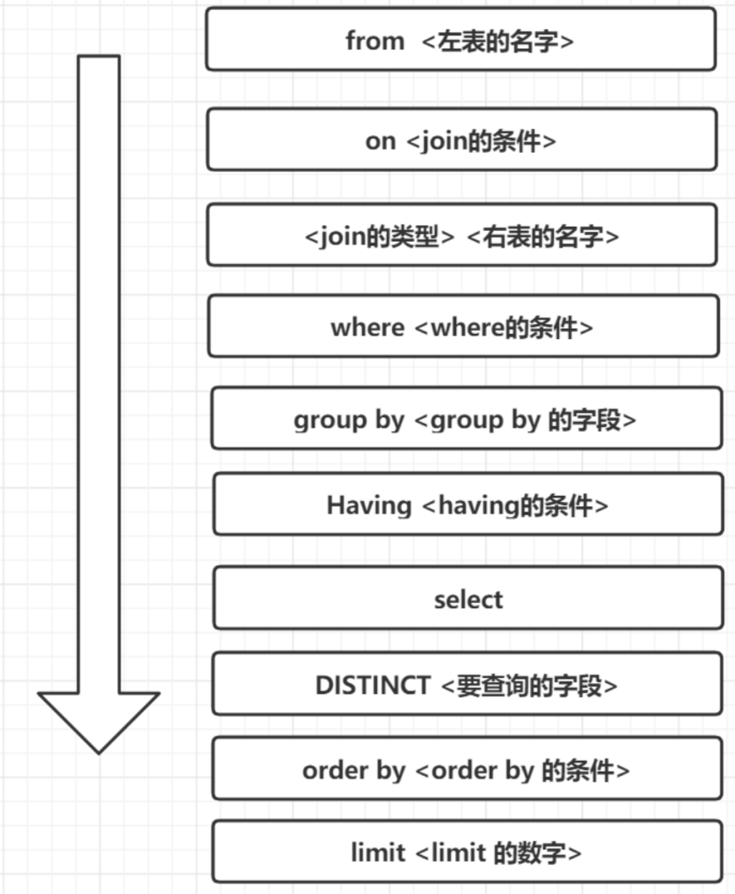​

### sql 语句执行过程

#### 查询 sql

* 执行前

  * 验证用户名，密码等
  * 建立 DB 连接，从连接池中获取连接
  * 查询用户权限表，查看是有有权限
* 开始执行

  * sql 发送给 sql 接口，对 sql 进行 hash 处理
  * sql 接口根据 hash 值检索是否有缓存
  * 缓存未命中，交给解析器，校验 sql 是否正确
  * 优化器制定执行计划
  * 调用存储引擎执行 sql
  * 存储引擎进行 IO 检索数据，返回给 sql 接口
  * sql 接口将结果集处理(剔除列，合并数据)返回

#### 写 sql

* 执行前

  * 验证用户名，密码等
  * 建立 DB 连接，从连接池中获取连接
  * 查询用户权限表，查看是有有权限
* 开始执行

  * sql 发送给 sql 接口，对 sql 进行 hash 处理
  * sql 接口根据 hash 值检索是否有缓存，如果有，对应缓存删掉
  * SQL 交给解析器，校验 sql 是否正确
  * 优化器制定执行计划
  * 在执行开始之前，先记录一下 `undo-log`​ 日志和 `redo-log`​(prepare 状态)日志
  * 在缓冲区中查找是否存在数据

    * 存在，对缓冲区进行写操作，利用 `checkpoint`​ 机制刷盘
    * 不在，调用存储引擎，从磁盘上的数据库文件中读取相应的数据页到缓冲池
  * 写操作完成后，记录 `bin-log`​ 日志，同时将 `redo-log`​ 日志中的记录改为 `commit`​ 状态
  * 将 SQL 执行耗时及操作成功的结果返回给 SQL 接口，再由 SQL 接口返回给客户端

### mysql 架构

#### 连接层

* 主要是指数据库连接池，会负责处理所有客户端接入的工作

#### 服务层

* SQL 接口

  * 当收到 SQL 语句时，SQL 接口会将其分发给其他组件，然后等待接收执行结果的返回，最后会将其返回给客户端
* 解析器

  * 词法分析、语义分析、语法树生成...这类
* 优化器

  * 生成执行计划
* 缓存区 `innodb_buffer_pool`​

  * 当你对数据库进行写操作时，都会先从缓冲区中查询是否有你要操作的页，如果有，则直接对内存中的数据页进行操作（例如修改、删除等），对缓冲区中的数据操作完成后，会直接给客户端返回成功的信息，然后 MySQL 会在后台利用一种名为 `Checkpoint`​ 的机制，将内存中更新的数据刷写到磁盘。

#### 存储引擎层

* MySQL 数据库中与磁盘文件打交道的子系统，执行 sql

#### 文件系统层

* 日志模块

  * binlog
  * redo-log
  * undo-log
  * slow-log
  * relay-log
  * error-log
* 数据板块

  * 所有数据最终都会落盘（写入到磁盘）

### InnoDb 内存结构

​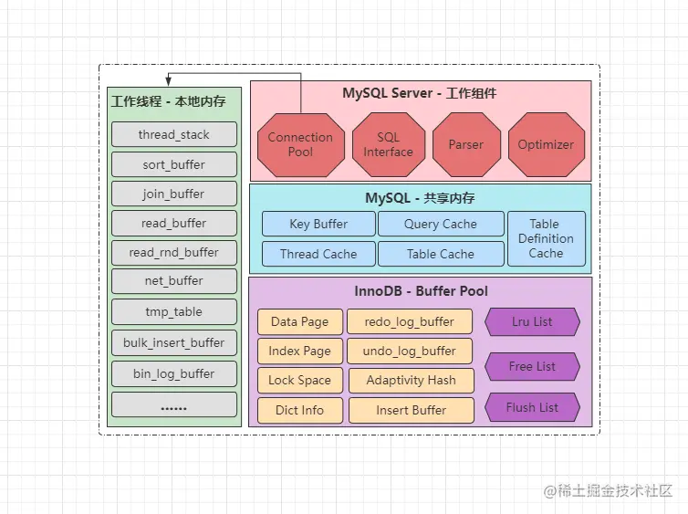​

注意观察，实际 `MySQL`​ 启动后内存结构略显复杂，但大体可分为 `MySQL工作组件`​、`线程本地内存`​、`MySQL共享内存`​、`存储引擎缓冲区`​ 四大板块。

> 实际上 `MySQL`​ 内存模型和 `JVM`​ 类似，`JVM`​ 内存主要会划分为 `线程共享区`​ 和 `线程私有区`​，而上图中的 `MySQL`​ 内存区域，左边则是 `线程私有区域`​，每条工作线程中都会分配的区域，各线程之间互不影响，而右边的三大板块，则属于 `线程共享区域`​，即所有线程都可访问的内存。

#### MySQL Server - 工作组件

后续客户端连接时，都需要经过一系列的连接工作，处理 `SQL`​ 时也需要经过一系列的解析、验证、优化工作，所以 `MySQL`​ 会在启动时，会先将这些工作组件初始化到内存中，方便后续处理客户端的操作。

#### 工作线程的本地内存

工作线程的本地内存区域，也被称之为 `线程私有区`​，即 `MySQL`​ 在创建每条线程时，都会为其分配这些内存。

* ​`thread_stack`​：线程堆栈，主要用于暂时存储运行的 SQL 语句及运算数据，和 Java 虚拟机栈类似。
* ​`sort_buffer`​：排序缓冲区，执行排序 SQL 时，用于存放排序后数据的临时缓冲区。
* ​`join_buffer`​：连接缓冲区，做连表查询时，存放符合连表查询条件的数据临时缓冲区。
* ​`read_buffer`​：顺序读缓冲区，MySQL 磁盘 IO 一次读一页数据，这个是顺序 IO 的数据临时缓冲区。
* ​`read_rnd_buffer`​：随机读缓冲区，当基于无序字段查询数据时，这里存放随机读到的数据。
* ​`net_buffer`​：网络连接缓冲区，这里主要是存放当前线程对应的客户端连接信息。
* ​`tmp_table`​：内存临时表，当 SQL 中用到了临时表时，这里存放临时表的结构及数据。
* ​`bulk_insert_buffer`​：MyISAM 批量插入缓冲区，批量 insert 时，存放临时数据的缓冲区。
* ​`bin_log_buffer`​：bin-log 日志缓冲区，[《日志篇》](https://juejin.cn/post/7157956679932313608#heading-11)提到过的，bin-log 的缓冲区被设计在工作线程的本地内存中。

将这些缓冲区都放在线程本地内存中，还有一点最大的好处：**能够提升多线程并发执行的性能**！这句话怎么理解呢？很简单，如果把上述的各个缓冲区放在共享内存中，然后提供给线程存放执行时的临时数据，因为多线程的缘故，所以同一时刻、同一快内存有可能出现多条线程一起操作，那就会出现线程不安全的问题，想要解决就只能加锁将多线程串行化，这自然会在很大程度上影响性能！因此将这些存临时数据的缓冲区，设计在本地内存中才最合适。

#### MySQL 共享内存区

* ​`Key Buffer`​：MyISAM 表的索引缓冲区，提升 MyISAM 表的索引读写速度。
* ​`Query Cache`​：查询缓存区，缓冲 SQL 的查询结果，提升热点 SQL 的数据检索效率。
* ​`Thread Cache`​：线程缓存区，存放工作线程运行期间，一些需要被共享的临时数据。
* ​`Table Cache`​：表数据文件的文件描述符缓存，提升数据表的打开效率。
* ​`Table Definition Cache`​：表结构文件的文件描述符缓存，提升结构表的打开效率。

##### MySQL8.x 为什么移除了查询缓存

很鸡肋，看个例子：

```sql
select * from zz_users where user_id=1;
select * from zz_users where user_id = 1;
```

​`MySQL查询缓存`​ 是以 SQL 的 `哈希值`​ 来作为 Key 的，上面两条 SQL 虽然一样，但是后面的查询条件有细微差别：`user_id=1`​、`user_id = 1`​，也就是一条 SQL 有空格，一条没有。由于这一点点细微差异，会导致两条 SQL 计算出的哈希值完全不同，因此无法命中缓存。

#### 存储引擎缓冲区(InnoDB Buffer Pool)

​​

* ​`Data Page`​：写入缓冲区，主要用来缓冲磁盘的表数据，将写操作转移到内存进行。
* ​`Index Page`​：索引缓冲页，对于所有已创建的索引根节点，都会放入到内存，提升索引效率。
* ​`Lock Space`​：锁空间，主要是存放所有创建出的锁对象，详情可参考[《MySQL 锁机制实现原理》](https://juejin.cn/post/7156111610589741063)。
* ​`Dict Info`​：数据字典，主要用来存储 MySQL-InnoDB 引擎自带的系统表。
* ​`redo_log_buffer`​：redo-log 缓冲区，存放写 SQL 执行时写入的 redo 记录。
* ​`undo_log_buffer`​：undo-log 缓冲区，存放写 SQL 执行时写入的 undo 记录。
* ​`Adaptivity Hash`​：自适应哈希索引，InnoDB 会为热点索引页，创建相应的哈希索引。
* ​`Insert Buffer`​：写入缓冲区，对于 insert 的数据，会先放在这里，然后定期刷写磁盘。
* ​`Lru List`​：内存淘汰页列表，对于整个缓冲池的内存管理列表（后续细聊）。
* ​`Free List`​：空闲内存列表，这里面记录着目前未被使用的内存页。
* ​`Flush List`​：脏页内存列表，这里主要记录未落盘的数据。

##### 缓存池的基本原理

 **「读操作」:**

在数据库中进行读取页的操作，首先把从磁盘读到的页存放在缓存池中，下一次读取相同的页时，首先判断该页是不是在缓存池中。

若在，称该页在缓存池中被命中，则直接读取该页，否则，还是去读取磁盘上的页。

 **「写操作」:**

对于数据库中页的修改操作，首先修改在缓存池中的页，然后在以一定的频率刷新到磁盘，并不是每次页发生改变就刷新回磁盘，而是通过 checkpoint 的机制把页刷新回磁盘。

若不在缓存池中，数据库将从磁盘读取需要修改的页到缓存池中。

**可以看到，无论是读操作还是写操纵，都是对缓存池进行操作，而不是直接对磁盘进行操纵。**

> **Checkpoint**：数据库在执行检查点（checkpoint）操作时，会将所有脏页写回磁盘，以确保数据的一致性。

##### 缓存池结构

Buffer Pool 是一片连续的内存空间，innodb 存储引擎是通过页的方式对这块内存进行管理的。

缓存池的结构如下图：

​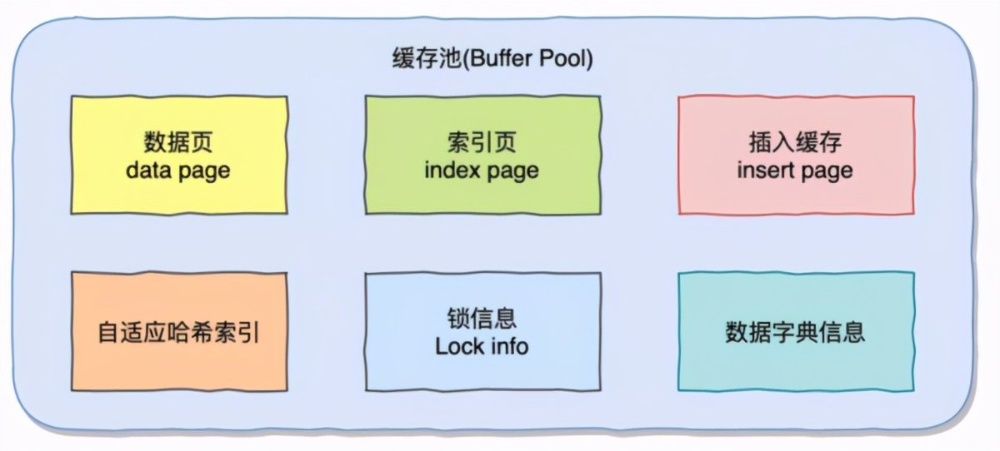​

###### 数据页（data page）

***结构***

页是 `InnoDB`​ 管理存储空间的基本单位，一个页的大小一般是 `16KB`​。InnoDB 为了不同的目的而设计了许多种不同类型的页，比如存放表空间头部信息的页，存放 Insert Buffer 信息的页，存放 INODE 信息的页，存放 `undo`​ 日志信息的页等等。

其中，我们日常口中所称的数据记录的页，称为数据页。

​​

* File Header 文件头部

  * 双链表
  * 针对各种页都通用的一些信息，比方说这个页的编号是多少，它的上一个页、下一个页是谁
* Page Header 页面头部

  * 专门针对数据页记录的各种状态信息，比方说页里头有多少个记录了呀，有多少个槽了呀
* Infimum + Supremum 虚拟行记录（最大、最小）
* User Records 用户记录

  * 实际存储的行记录内容
* Free Space 空闲空间
* Page Directory 页面目录

  * 将页中的记录分组，每组最后一条记录的偏移量作为一个 slot 槽，放在 `page directory`​ 中

    * 所以根据主键查找是先二分确定所在槽，然后根据记录中的 `next-record`​ 遍历，找到记录
* File Trailer 文件尾部

 **User Records**

在页的 7 个组成部分中，我们自己存储的记录会按照我们指定的行格式存储到 `User Records`​ 部分。但是在一开始生成页的时候，其实并没有 `User Records`​ 这个部分，每当我们插入一条记录，都会从 `Free Space`​ 部分，也就是尚未使用的存储空间中申请一个记录大小的空间划分到 `User Records`​ 部分，当 `Free Space`​ 部分的空间全部被 `User Records`​ 部分替代掉之后，也就意味着这个页使用完了，如果还有新的记录插入的话，就需要去申请新的页了，这个过程的图示如下：

​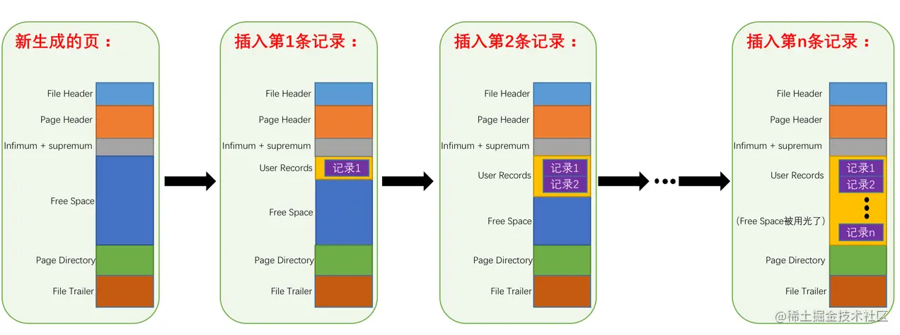​

为了更好的管理在 `User Records`​ 中的这些记录，`InnoDB`​ 可费了一番力气呢。

​**​`记录头信息`​**​

我们先创建一个表：

```sql
mysql> CREATE TABLE page_demo(
    ->     c1 INT,
    ->     c2 INT,
    ->     c3 VARCHAR(10000),
    ->     PRIMARY KEY (c1)
    -> ) CHARSET=ascii ROW_FORMAT=Compact;
Query OK, 0 rows affected (0.03 sec)
```

简化后的行格式示意图就是这样：

​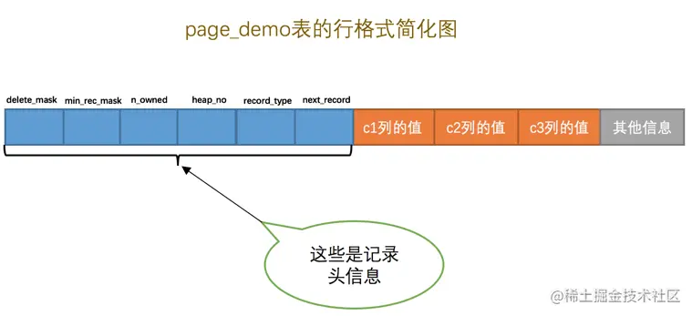​

下边我们试着向 page_demo 表中插入几条记录：

```sql
mysql> INSERT INTO page_demo VALUES(1, 100, 'aaaa'), (2, 200, 'bbbb'), (3, 300, 'cccc'), (4, 400, 'dddd');
Query OK, 4 rows affected (0.00 sec)
Records: 4  Duplicates: 0  Warnings: 0
```

​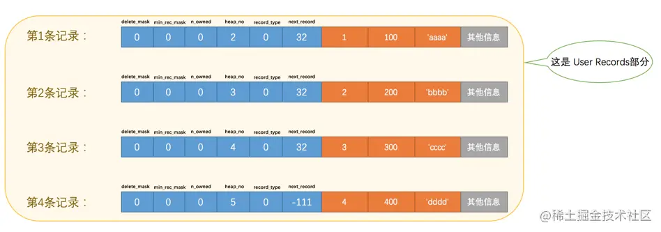​

我们对照着这个图来看看记录头信息中的各个属性是啥意思：

* ​`delete_mask`​

  * 这个属性标记着当前记录是否被删除
  * 这些被删除的记录不立即从磁盘上移除，因为移除它们之后把其他的记录在磁盘上重新排列需要性能消耗，所以只是打一个删除标记而已，所有被删除掉的记录都会组成一个所谓的 `垃圾链表`​，在这个链表中的记录占用的空间称之为所谓的 `可重用空间`​，之后如果有新记录插入到表中的话，可能把这些被删除的记录占用的存储空间覆盖掉。
* ​`min_rec_mask`​

  * B+ 树的每层非叶子节点中的最小记录都会添加该标记
  * 我们自己插入的四条记录的 min_rec_mask 值都是 0，意味着它们都不是 B+ 树的非叶子节点中的最小记录
* ​`n_owned`​

  * 表示当前记录拥有的记录数
* ​`heap_no`​

  * 这个属性表示当前记录在本 `页`​ 中的位置
  * 从图中可以看出来，我们插入的 4 条记录在本页中的位置分别是：`2`​、`3`​、`4`​、`5`​。是不是少了点啥？是的，怎么不见 `heap_no`​ 值为 `0`​ 和 `1`​ 的记录呢？

> 不管我们向页中插入了多少自己的记录，InnoDB 定义的两条伪记录分别为 `最小记录`​ 与 `最大记录`​。他们并不存放在页的 `User Records`​ 部分，他们被单独放在一个称为 `Infimum + Supremum`​ 的部分

* ​`record_type`​

  * 这个属性表示当前记录的类型，一共有 4 种类型的记录，0 表示普通记录，1 表示 B+ 树非叶节点记录，2 表示最小记录，3 表示最大记录。
  * 从图中我们也可以看出来，我们自己插入的记录就是普通记录，它们的 record_type 值都是 0，而最小记录和最大记录的 record_type 值分别为 2 和 3。
* ​`next_record`​

  * 表示从当前记录的真实数据到下一条记录的真实数据的地址偏移量
  * 比方说第一条记录的 next_record 值为 32，意味着从第一条记录的真实数据的地址处向后找 32 个字节便是下一条记录的真实数据

​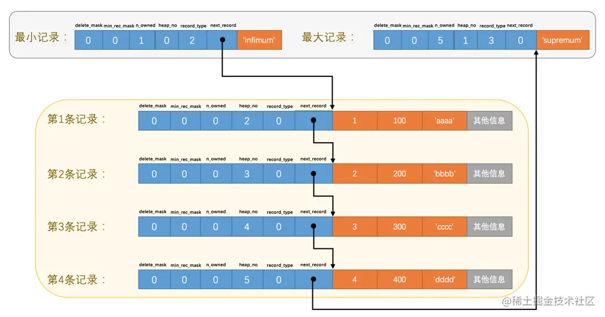​

* 从图中可以看出来，我们的记录按照主键从小到大的顺序形成了一个单链表。`最大记录`​ 的 `next_record`​ 的值为 0，这也就是说最大记录是没有下一条记录了，它是这个单链表中的最后一个节点。如果从中删除掉一条记录，这个链表也是会跟着变化的，比如我们把第 2 条记录删掉：

  ​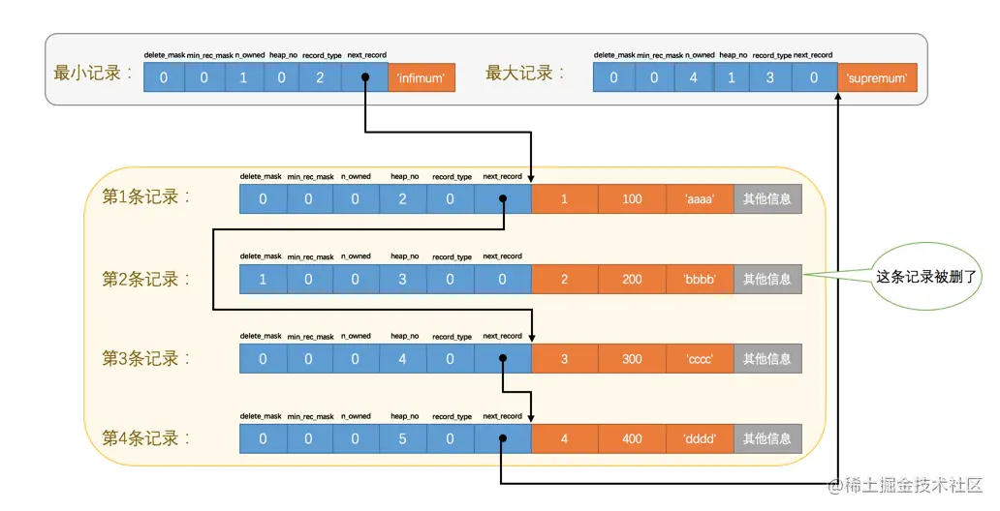​

从图中可以看出来，删除第 2 条记录前后主要发生了这些变化：

* 第 2 条记录并没有从存储空间中移除，而是把该条记录的 `delete_mask`​ 值设置为 1。
* 第 2 条记录的 `next_record`​ 值变为了 0，意味着该记录没有下一条记录了。
* 第 1 条记录的 `next_record`​ 指向了第 3 条记录。
* 还有一点你可能忽略了，就是最大记录的 n_owned 值从 5 变成了 4。

***Page Directory（页目录）***

现在我们了解了记录在页中按照主键值由小到大顺序串联成一个单链表，那如果我们想根据主键值查找页中的某条记录该咋办呢？

最笨的办法：从 `Infimum记录（最小记录）`​ 开始，沿着链表一直往后找，总有一天会找到，这样性能太差。

InnoDB 制作了一个类似书的目录：

1. 将所有正常的记录（包括 `最大`​ 和 `最小记录`​，不包括标记为已删除的记录）划分为几个组。
2. 每个组的最后一条记录（也就是组内最大的那条记录）的头信息中的 `n_owned`​ 属性表示该记录拥有多少条记录，也就是该组内共有几条记录。
3. 将每个组的最后一条记录的地址偏移量单独提取出来按顺序存储到靠近页的尾部的地方，这个地方就是所谓的 `Page Directory`​，也就是页目录（此时应该返回头看看页面各个部分的图）。页面目录中的这些地址偏移量被称为 `槽`​（英文名：`Slot`​），所以这个页面目录就是由 `槽`​ 组成的。

比方说现在的 page_demo 表中正常的记录共有 6 条，InnoDB 会把它们分成两组，第一组中只有一个最小记录，第二组中是剩余的 5 条记录，看下边的示意图：

​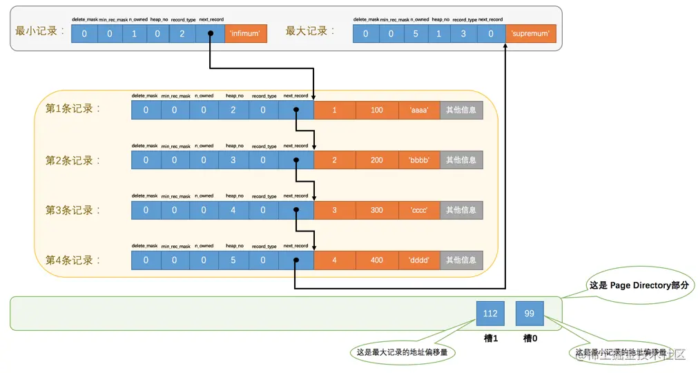​

从这个图中我们需要注意这么几点:

* 现在 `页目录`​ 部分中有两个槽，也就意味着我们的记录被分成了两个组，`槽1`​ 中的值是 112，代表最大记录的地址偏移量（就是从页面的 0 字节开始数，数 112 个字节）；`槽0`​ 中的值是 99，代表最小记录的地址偏移量。
* 注意最小和最大记录的头信息中的 `n_owned`​ 属性

  * 最小记录的 `n_owned`​ 值为 1，这就代表着以最小记录结尾的这个分组中只有 1 条记录，也就是最小记录本身。
  * 最大记录的 `n_owned`​ 值为 5，这就代表着以最大记录结尾的这个分组中只有 5 条记录，包括最大记录本身还有我们自己插入的 4 条记录。

​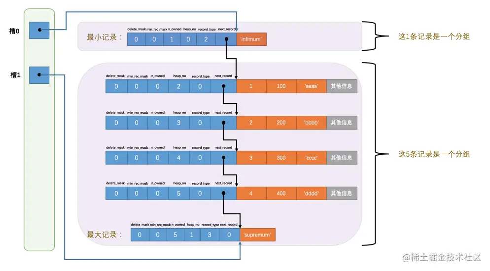​

我们一口气又往表中添加了 12 条记录，现在页里边就一共有 18 条记录了（包括最小和最大记录），这些记录被分成了 5 个组，如图所示：

​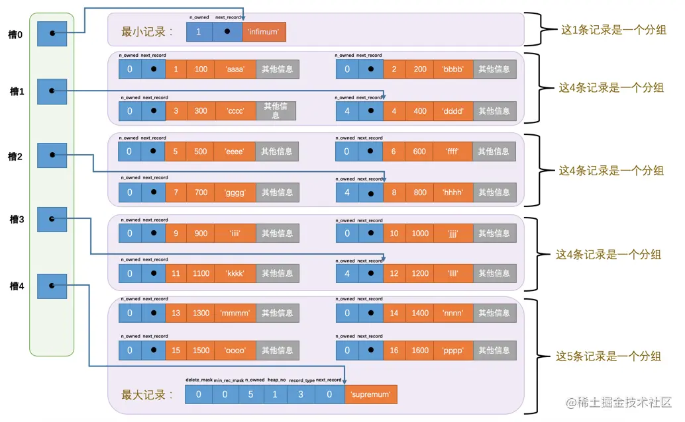​

比方说我们想找主键值为 `6`​ 的记录，过程是这样的：

1. 计算中间槽的位置：`(0+4)/2=2`​，所以查看 `槽2`​ 对应记录的主键值为 `8`​，又因为 `8 > 6`​，所以设置 `high=2`​，`low`​ 保持不变。
2. 重新计算中间槽的位置：`(0+2)/2=1`​，所以查看 `槽1`​ 对应的主键值为 `4`​，又因为 `4 < 6`​，所以设置 `low=1`​，`high`​ 保持不变。
3. 因为 `high - low`​ 的值为 1，所以确定主键值为 `6`​ 的记录在 `槽2`​ 对应的组中。此刻我们需要找到 `槽2`​ 中主键值 `最小的那条记录`​，然后沿着单向链表遍历 `槽2`​ 中的记录。但是我们前边又说过，每个槽对应的记录都是该组中主键值最大的记录，这里槽 2 对应的记录是主键值为 8 的记录，怎么定位一个组中最小的记录呢？别忘了各个槽都是挨着的，我们可以很轻易的拿到 `槽1`​ 对应的记录（主键值为 `4`​），该条记录的下一条记录就是 `槽2`​ 中主键值最小的记录，该记录的主键值为 `5`​。所以我们可以从这条主键值为 `5`​ 的记录出发，遍历 `槽2`​ 中的各条记录，直到找到主键值为 `6`​ 的那条记录即可。由于一个组中包含的记录条数只能是 1~8 条，所以遍历一个组中的记录的代价是很小的。

所以在一个数据页中查找指定主键值的记录的过程分为两步：

1. 通过 `二分法`​ 确定该记录所在的槽，并找到该槽所在分组中主键值最小的那条记录。
2. 通过记录的 `next_record`​ 属性遍历该槽所在的组中的各个记录。

***Page Header（页面头部）***

​`InnoDB`​ 为了能得到一个 `数据页`​ 中存储的记录的状态信息，比如本页中已经存储了多少条记录，第一条记录的地址是什么，页目录中存储了多少个槽等等，特意在页中定义了一个叫 Page Header 的部分。

***File Header（文件头部）***

上边的 `Page Header`​ 是专门针对 `数据页`​ 记录的各种状态信息，比方说页里头有多少个记录了呀，有多少个槽了呀。我们现在描述的 `File Header`​ 针对各种类型的 `页`​ 都通用，也就是说不同类型的页都会以 `File Header`​ 作为第一个组成部分，它描述了一些针对各种 `页`​ 都通用的一些信息，比方说这个页的编号是多少，它的上一个页、下一个页是谁。

我们看几个目前比较重要的部分：

* ​`FIL_PAGE_SPACE_OR_CHKSUM`​

  * 这个代表当前页面的校验和（checksum）。啥是个校验和？就是对于一个很长很长的字节串来说，我们会通过某种算法来计算一个比较短的值来代表这个很长的字节串，这个比较短的值就称为校验和。这样在比较两个很长的字节串之前先比较这两个长字节串的校验和，如果校验和都不一样两个长字节串肯定是不同的，所以省去了直接比较两个比较长的字节串的时间损耗。
* ​`FIL_PAGE_OFFSET`​

  * 每一个页都有一个单独的页号，就跟你的身份证号码一样，`InnoDB`​ 通过 `页号`​ 来可以唯一定位一个 `页`​。
* ​`FIL_PAGE_TYPE`​

  * 这个代表当前页的类型，`InnoDB`​ 为了不同的目的而把页分为不同的类型。
* ​`FIL_PAGE_PREV`​ 和 `FIL_PAGE_NEXT`​

  * 分别代表本页的上一个和下一个页的页号，形成双链表

​​

***File Trailer***

为了检测一个页是否完整（也就是在同步的时候有没有发生只同步一半的尴尬情况），`InnoDB`​ 在每个页的尾部都加了一个 `File Trailer`​ 部分，与 `File Header`​ 类似，都是所有类型的页通用的。

***总结***

1. ​`InnoDB`​ 为了不同的目的而设计了不同类型的页，我们把用于存放记录的页叫做 `数据页`​。
2. 一个数据页可以被大致划分为 7 个部分，分别是

    * File Header 文件头部

      * 双链表
      * 针对各种页都通用的一些信息，比方说这个页的编号是多少，它的上一个页、下一个页是谁
    * Page Header 页面头部

      * 专门针对数据页记录的各种状态信息，比方说页里头有多少个记录了呀，有多少个槽了呀
    * Infimum + Supremum 虚拟行记录（最大、最小）
    * User Records 用户记录

      * 实际存储的行记录内容
    * Free Space 空闲空间
    * Page Directory 页面目录

      * ​`InnoDB`​ 会把页中的记录划分为若干个 `组`​，每个组的 `最后一个`​ 记录的 `地址偏移量`​ 作为一个 `槽`​，存放在 `Page Directory`​ 中，所以在一个 `页`​ 中根据 `主键`​ 查找记录是非常快的，分为两步：

        * 通过二分法确定该记录所在的 `槽`​。
        * 通过记录的 `next_record`​ 属性遍历该槽所在的组中的各个记录。
    * File Trailer 文件尾部，用于检验页是否完整的部分

3. 每个记录的头信息中都有一个 `next_record`​ 属性，从而使页中的所有记录串联成一个 `单链表`​
4. 每个数据页的 `File Header`​ 部分都有上一个和下一个页的编号，所以所有的数据页会组成一个 `双链表`​。
5. 为保证从内存中同步到磁盘的 `页的完整性`​，在页的首部和尾部都会存储页中数据的校验和和页面最后修改时对应的 `LSN`​ 值，如果首部和尾部的校验和和 `LSN`​ 值校验不成功的话，就说明同步过程出现了问题。

###### 索引缓冲页（Index Page）

专门用来存放载入的索引数据，存储这些数据的缓冲页，则被称之为索引页。随着运行时间的增长，也会将一些非根节点的索引页载入内存中，这是一种对于访问频率较高的索引页，专门推出的优化机制。

###### 锁空间（Lock Space）

锁空间不仅仅只会存储锁结构，还会存储一些并发事务的链表，例如死锁检测时需要的「事务等待链表、锁的信息链表」等。

###### 数据字典（Dict Info）

在 `InnoDB`​ 引擎中主要存在 `SYS_TABLES`​、`SYS_COLUMNS`​、`SYS_INDEXES`​、`SYS_FIELDS`​ 这四张系统表，主要是用来维护用户定义的所有表的各种信息，如下：

* SYS_TABLES

  * 这张表中会存储所有引擎为 InnoDB 的表信息。
* SYS_COLUMNS

  * 这张表用来存储所有用户定义的表字段信息。
* SYS_INDEXES

  * 这张表用来存储所有 InnoDB 引擎表的索引信息。
* SYS_FIELDS

  * 这张表用来存储所有索引的定义信息。

这四张表也被称为 `InnoDB`​ 的内部表，这四张表在载入内存前，位于 `.ibdata`​ 文件中，在 MySQL 启动时会开始加载，载入内存后就会放入到 `Dict Info`​ 这块区域，当利用 `show`​ 语句查询表的结构信息时，就会在字典信息中检索数据。

###### 日志缓冲区（Log Buffer）

​`InnoDB`​ 的缓冲池中，主要存在两个日志缓冲区，即 `undo_log_buffer`​、`redo_log_buffer`​，分别对应着撤销日志和重做日志。它俩的作用主要是用来提升日志记录的写入速度，因为日志文件在磁盘中，执行 SQL 时直接往磁盘写日志，其效率太低了，因此会先写缓冲区，再由后台线程去刷写日志。

###### 自适应哈希索引（Adaptivity Hash）

哈希算法查找数据的效率非常高，在没有哈希冲突的情况下复杂度为 `O(1)`​，而 `B+Tree`​ 检索数据的效率，取决于树的高度。建立索引时，只能选用一种数据结构来作为索引的底层结构：

* 如果选择哈希结构，虽然效率高，但数据是无序的，因此不方便做排序查询。
* 如果选择 `B+Tree`​ 结构，虽然有序，但查询的效率会受到树高的影响。

​`InnoDB`​ 实现了一种名为自适应哈希索引的技术，在 MySQL 运行过程中，`InnoDB`​ 引擎会对表上的索引做监控，如果某些数据经常走索引查询，那 `InnoDB`​ 就会为其建立一个哈希索引，以此来提升数据检索的效率，并且减少走 `B+Tree`​ 带来的开销，由于这种哈希索引是运行过程中，`InnoDB`​ 根据 `B+Tree`​ 的索引查询次数来建立的，因此被称之为自适应哈希索引。

> ​`自适应哈希索引`​ 和 `普通哈希索引`​ 的区别在哪儿呢？`普通哈希索引`​ 是在创建索引时将结构声明为 `Hash`​ 结构，这种索引会以索引字段的整表数据建立哈希，而 `自适应哈希索引`​ 是根据缓冲池的 `B+树`​ 构造而来，只会基于热点数据构建，因此建立的速度会非常快，毕竟无需对整表都建立哈希索引。

###### 写入缓冲区（Insert Buffer）

如果要变更的数据页在缓冲区中存在，则会直接修改缓冲区中的数据页，然后标记一下变更过的数据页，但如果要操作的数据页并未被加载到缓冲区，那依旧会走磁盘去操作数据，走磁盘显然会影响性能，因此 `InnoDB`​ 就创造了一个「`写入缓冲`​」。

写入缓冲对于 insert、delete、update 语句都可生效，当一条写入语句执行时，流程如下：

* ① 判断要变更的数据页是否被载入到内存。
* ② 如果内存中有对应的数据页，则直接变更缓冲区中的数据页，完成标记后则直接返回。
* ③ 如果内存中没有对应的数据页，则将要变更的数据放入到「写入缓冲」中，然后返回。

此时会发现，不管内存中是否存在相应的数据页，`InnoDB`​ 都不会走磁盘写数据，而是直接在内存中完成所有操作，但是要注意：**​`并不是所有的写入动作，都可以在内存中完成`​**​，「写入缓冲」是有 `限制`​ 的，如下：

* 插入的数据字段不能具备 `唯一约束`​ 或 `唯一索引`​。

为啥呢？因为如果存在唯一字段的表，在插入数据前必须要先判断表中是否存在相同值，一张表的数据不可能全部都载入数据，所以这个判断重复值的工作必须依赖磁盘中的表数据来完成，所以插入具备唯一性的数据时，就必须要走磁盘。

##### InnoDB 缓冲池 管理内存

* 原理

  * Free 链表

    * 统一管理、分配所有未使用的缓冲页
  * Flush 链表

    * 统一管理、刷写所有被标记过的缓冲页（脏页）
  * Lru 链表

    * 统一管理、淘汰所有已使用、未变更过的缓冲页
* 数据转换

  * 当 LRU 链表中的一个数据页发生变更后，会从 LRU 链表转到 Flush 链表
  * 当标记页中的变更数据落盘后，此时标记页又会从 Flush 链表回到 LRU 链表
* 在内存的淘汰机制方面，InnoDB 基于末尾淘汰机制做了两点改善：

  * ① 将 Lru 链表划分为了 young、old 两个分区，用来解决预读失效导致的内存占用问题。
  * ② 引入了 young 区的晋升限制，解决了全表扫描时，young 区的热点数据页被换出的问题。

### 索引

#### 索引类型

* 功能维度

  * 普通索引

    * 一个列
  * 唯一索引
  * 复合索引

    * 多个列
  * 前缀索引

    * 字段的前 N 个字符，创建索引
  * hash 索引
* 存储方式

  * 聚集索引（主键索引）

    * 叶子节点 -> 索引列和行数据
    * 一张表只能有一个聚簇索引
  * 非聚集索引

    * 叶子节点 -> 索引列和主键 id
    * 回表
    * 索引覆盖

#### 优劣势

* 前缀索引

  * 短小精悍
  * 未存储整个字段，所以无法完成 order by, group by
* 唯一索引

  * 查询快，找到一条就停止检索
  * 插入相对慢，遍历所有数据，确保唯一
* hash 索引

  * 查询巨快
  * 无法完成排序，分组等

#### 索引失效

* 隐式转换
* 函数计算
* 前导模糊查询
* 联合索引最左前缀原则
* 负向条件 !=, not in

#### 索引下推

> 将 Server 层筛选数据的工作，下推到引擎层处理

* 用户表建立 name，sex 联合索引
* ​`select * from user where name like '竹%' and sex = '男' `​

由于 % 模糊查询，只能用到 name 索引，返回多条 id 给到 server 层，回表扫描，逐条判断，筛选出数据

整个查询过程如下：

* ① 利用联合索引中的 `user_name`​ 字段找出「竹子、竹竹」两个索引节点。
* ② 返回索引节点存储的值「2、5」给 Server 层，然后去逐一做回表扫描。
* ③ 在 Server 层中根据 `user_sex="男"`​ 这个条件逐条判断，最终筛选到「竹子」这条数据。

假如索引下推之后是这样：

* ① 利用联合索引中的 `user_name`​ 字段找出「竹子、竹竹」两个索引节点。
* ② 根据 `user_sex="男"`​ 这个条件在索引节点中逐个判断，从而得到「竹子」这个节点。
* ③ 最终将「竹子」这个节点对应的「2」返回给 Server 层，然后聚簇索引中回表拿数据。

相较于没有索引下推之前，原本需要做「`2、5`​」两次回表查询，但在拥有索引下推之后，仅需做「`2`​」一次回表查询。

#### MRR

> 针对于辅助索引的回表查询，减少离散 IO，并且将随机 IO 转换为顺序 IO，从而提高查询效率

* 查找的数据，可能分布在不同的页中，可能来回来切换
* 对于辅助索引中查询出的 ID，会将其放到缓冲区
* 达到一定大小后，排序
* 再顺序 IO 去取数据

#### 查询相关算法

* 二分法

  * 不支持动态插入和删除操作
* 二叉查找树 BST

  * 解决了排序的基本问题，但是由于无法保证平衡，可能退化为链表
* 平衡二叉树 AVL

  * 通过旋转解决了平衡的问题，但是旋转操作效率太低
* 红黑树

  * 通过舍弃严格的平衡和引入红黑节点，解决了 AVL 旋转效率过低的问题，但是在磁盘等场景下，树仍然太高，IO 次数太多；
* 多路平衡查找树 B 树

  * 通过将二叉树改为多路平衡查找树，解决了树过高的问题；
* B+ 树

  * 更少的 IO 次数
  * 更适用于范围查找
  * 更稳定的查询效率

* 所有叶子节点包含了全部信息
* 各叶子节点用指针进行连接，范围查询更加高效。
* 在 B 树的基础上，将非叶子节点改造成只存储 key 的信息，进一步降低了树的高度

### 事务

#### 四大特性 ACID

* 原子性

  * 使用 undo log 实现，如果事务执行出错或者执行了 rollback，通过 undo log 恢复
* 一致性

  * 通过其他三个特性实现
* 隔离性

  * 通过锁以及 MVCC 实现
* 持久性

  * redo log 实现持久化，系统崩了，通过 redo log 恢复

#### 并发问题

* 脏读

  * 事务 A 正在访问数据，读到了事务 B 未提交事务的数据
* 不可重复读

  * 同一事务内，多次读取一条记录发现其中某些列的值被修改
* 幻读

  * 同一事务内，多次读取发现记录变多或者变少了

#### 隔离级别

##### RU 读未提交(READ-UNCOMMITTE)

* 读操作不加锁，写操作加 X（排他锁）
* 由于写使用X record 则不会产生脏写，会产生 `脏读、不可重复读、幻读`​

##### RC 读已提交(READ-COMMITTED)

* 读使用 `mvcc`​（每次读生成 `read view快照`​`，然后依据这个快照去选择一个可读的数据版本`​​），写使用`X record`​（排他锁）
* 会有 `不可重复读、幻读`​

##### RR 可重复读(REPEATABLE-READ)

* 读使用 `mvcc`​（第一次读生成 `read view`​），写使用`X next key`​（临键锁，即读操作执行时，不允许其他事务改动数据）
* 会有 `幻读（基本解决）`​

##### 串行化(SERIALIZABLE)

* 所有写操作加临键锁（具备互斥特性），所有读操作加共享锁。
* 由于所有写操作在执行时，都会获取临键锁，所以写-写、读-写、写-读这类并发场景都会互斥，而由于读操作加的是共享锁，因此在`Serializable`​级别中，只有读-读场景可以并发执行。
* 不会产生脏写、脏读、不可重复读、幻读

> 虽然`DBMS`​中要求在序列化级别再解决幻读问题，但在`MySQL`​中，`RR`​级别中就已经解决了幻读问题，因此`MySQL`​中可以将`RR`​级别视为最高级别，而`Serializable`​级别几乎用不到，因为序列化级别中解决的问题，在`RR`​级别中基本上已经解决了，再将`MySQL`​调到`Serializable`​级别反而会降低性能。
>
> 当然，`RR`​级别下有些极端的情况，依旧会出现幻读问题，但线上`100%`​不会出现。

#### 小争议：MVCC机制是否彻底解决了幻读问题呢？

​`MVCC`​并没有彻底解决幻读问题，在一种奇葩的情况下依旧会出现问题。

```sql
-- 开启一个事务T1
begin;
-- 查询表中 ID>10 的数据
SELECT * FROM `zz_users` where user_id > 10;
```

因为用户表中不存在`ID>10`​的数据，所以`T1`​查询时没有结果。

```sql
-- 再开启一个事务T2
begin;
-- 向表中插入一条 ID=11 的数据
INSERT INTO `zz_users` VALUES(11,"墨竹","男","2222","2022-10-07 23:24:36");
-- 提交事务T2
commit;
```

此时`T2`​事务插入一条`ID=11`​的数据并提交，此时再回到`T1`​事务中：

```sql
-- 在T1事务中，再次查询表中 ID>10 的数据
SELECT * FROM `zz_users` where user_id > 10;
```

结果很明显，依旧未查询到`ID>10`​的数据，因为这里是通过第一次生成的快照文件在读，所以读不到`T2`​新增的“幻影数据”，似乎没问题对嘛？

```sql
-- 在T1事务中，对 ID=11 的数据进行修改
UPDATE `zz_users` SET `password` = "1111" where `user_id` = 11;

-- 在T1事务中，再次查询表中 ID>10 的数据
SELECT * FROM `zz_users` where user_id > 10;
+---------+-----------+----------+----------+---------------------+
| user_id | user_name | user_sex | password | register_time       |
+---------+-----------+----------+----------+---------------------+
|      11 | 墨竹      | 男       | 1111     | 2022-10-07 23:24:36 |
+---------+-----------+----------+----------+---------------------+
```

嗯？！？？此时会发现，`T1`​事务中又能查询到`ID=11`​的这条幻影记录了，这是啥原因导致的呢？因为我们在`T1`​中修改了`ID=11`​的数据，在[《MVCC机制原理剖析》](https://juejin.cn/post/7155359629050904584 "https://juejin.cn/post/7155359629050904584")中曾讲过`MVCC`​通过快照检索数据的过程，这里`T1`​根据原本的快照文件检索数据时，因为发现`ID=11`​这条数据上的隐藏列`trx_id`​是自己，因此就能看到这条幻影数据了。

> 实际上这个问题有点四不像，可以理解成幻读问题，也可以理解成是不可重复读问题，总之不管怎么说，就是`MVCC`​机制存在些许问题！但这种情况线下一般不会发生，毕竟不同事务之间都是互不相知的，在一个事务中，不可能会去主动修改一条“不存在”的记录。

#### 实现原理

**MySQL 的事务机制是基于日志实现的**。

* ​`start transaction;`​ 关闭自动提交机制
* 生成 `redo log`​(`prepare状态`​)，并生成 `undo log`​，执行 `sql`​，将数据更新到 `BufferPool`​ 缓冲区中，生成 `bin log`​
* 遇到 `rollback`​，在 `undo log`​ 中找到 `撤销sql`​ 执行，将缓冲区数据还原
* 遇到 `commit`​，`redo log`​ 改为 `commit`​ 状态，异步刷盘

### 锁

#### 分类

* 锁粒度

  * 表锁

    * 全局锁

      * ​`LOCK TABLES table_name READ;`​
      * ​`LOCK TABLES table_name WRITE;`​
    * 意向锁

      * 当 `事务A`​ 想获取某个表的 `表锁`​ 的时候，需要对该表下的每一行记录进行[遍历](https://so.csdn.net/so/search?q=遍历&spm=1001.2101.3001.7020)，查看是否有其他事务进行了锁的获取，如果存在排它锁，则需要等待其他事务释放所有锁才能后的表锁。其中的遍历成本大，所以引入了 `意向锁`​。
    * 自增锁（AUTO-INC 锁）

      * **自增锁主要负责维护并发事务下自增列的顺序**
      * 三种模式

        * 传统模式

          * 事务 T1 获取自增锁插入数据，事务 T2 也要插入数据，此时事务 T2 只能阻塞等待
          * 同时只允许一条线程执行，性能低
        * 连续模式

          * 插入之前就确定了数据量，所以直接分配范围自增值
        * 交错模式

          * 指通过 INSERT INTO table_name(id,...) VALUES(1,...),(NULL,...),(3,...)这种方式插入，其中一部分指定 ID，一部分不指定
          * 交错预分配
          * 好比给 `T1`​ 分配{`1、3、5、7、9....`​}，给 `T2`​ 分配{`2、4、6、8、10....`​}
  * 行锁

    * 记录锁（Record 锁）

      * 锁一条记录
    * 间隙锁（Gap 锁）

      * ```sql
        SELECT * FROM `zz_users`;
        +---------+-----------+----------+----------+---------------------+
        | user_id | user_name | user_sex | password | register_time       |
        +---------+-----------+----------+----------+---------------------+
        |       1 | 熊猫      | 女       | 6666     | 2022-08-14 15:22:01 |
        |       2 | 竹子      | 男       | 1234     | 2022-09-14 16:17:44 |
        |       3 | 子竹      | 男       | 4321     | 2022-09-16 07:42:21 |
        |       4 | 猫熊      | 女       | 8888     | 2022-09-27 17:22:59 |
        |       9 | 黑竹      | 男       | 9999     | 2022-09-28 22:31:44 |
        +---------+-----------+----------+----------+---------------------+
        ```
      * 解决幻读
      * ​`select * from `​ users `where id = 6 lock in share mode;`​
      * 锁(`4,9`​)，左右开区间
    * 临建锁（Next-Key 锁）

      * 锁定的范围是左右开区间，但不包含当前这一条真实数据，只锁间隙区域
      * 间隙锁的升级版，同时具备记录锁 + 间隙锁的功能
* 互斥性

  * 共享锁（S 锁）

    * SELECT ... FOR SHARE
  * 排他锁（X 锁）

    * SELECT ... FOR UPTATE
  * 共享排他锁（SX 锁）
* 操作类型

  * 读锁
  * 写锁

#### 加锁规则

> S锁：`select ... lock in share mode`​
>
> X锁：`select ... for update`​
>
> 通常把加锁的select称为锁定读，而在普通的update和delete时，需要先进行读（找到记录）再操作，在这种情况下加锁规则也可以归为锁定读

##### 锁定读加锁规则

1. **在RC及以下隔离级别，锁定读使用record锁；在RR及以上隔离级别，锁定读使用next key锁** （间隙锁的范围是前开后闭）

    1. （具体S、X锁则看SQL，如果是 `select ... lock in share mode`​ 则是S锁
    2. 如果是 `select ... for update`​、`update ...`​、`delete ...`​ 则是X锁）
2. **值查询**

    1. **如果找不到记录，该查询条件所在区间加GAP锁；**
    2. **如果找到记录，唯一索引临键锁退化为记录锁，非唯一索引需要扫描到第一条不满足条件的记录，最后临键锁退化为间隙锁（不在最后一条不满足条件的记录上加记录锁）**
3. **范围查询：非唯一索引需要扫描到第一条不满足条件的记录**
4. **在查找的过程中，使用到什么索引就在那个索引上加锁，遍历到哪条记录就给哪条先加锁**

    1. （查找时走二级索引，如果要回表查聚簇索引，则还会在聚簇索引上加锁）
    2. （修改时如果二级索引上也存在要修改的值，则还要去二级索引中查找加锁并修改）

5. **在RC及以下隔离级别下，查找过程中如果记录不满足当前查询条件则会释放锁；在RR及以上无论是否满足查询条件，只要遍历过记录就会加锁，直到事务提交才释放**（RR及以上获取锁的时间会更长）

##### 新增的加锁

> 前面说到update、delete这种先查再写的操作可以看成加X锁的锁定读，而select的锁定读分为S、X，还剩insert的规则没有说明。

新增加锁规则分为三种情况：**正常情况、遇到重复冲突的情况、外键情况。**

新增时加的锁叫插入意向锁，它是隐式锁

当别的事务想要获取该记录的X/S锁时，查看该记录的事务id是不是活跃事务，如果活跃（事务未提交）则会帮新增记录的事务生成锁结构，此时插入意向锁变成显示锁（可以看成X锁）

###### **正常情况下加锁：**

1. **一般情况下，插入使用隐式锁（插入意向锁），不生成锁结构**
2. **当插入意向锁（隐式锁）被其他事务生成锁结构时变为显示锁（X record）**

###### **重复冲突加锁：**

1. **当insert遇到重复主键冲突时，RC及以下加S record，RR及以上加S next key**
2. **当insert遇到重复唯一二级索引时，加S next key**  
    **如果使用** **​`ON DUPLICATE KEY update`​**​ **那么S锁会换成X锁**

###### 外键加锁：

一般不做物理外键，略...

#### 行锁案例分析

##### 搭建环境

先建立一张测试表，其中id为主键，以s\_name建立索引

```sql
CREATE TABLE `s` (
  `id` int(11) NOT NULL,
  `s_name` varchar(255) DEFAULT NULL,
  `s_age` varchar(255) DEFAULT NULL,
  PRIMARY KEY (`id`),
  KEY `name_idx` (`s_name`)
) ENGINE=InnoDB DEFAULT CHARSET=utf8;
```

再插入一些记录

```sql
INSERT INTO `s` (`id`, `s_name`, `s_age`) VALUES (1, 'juejin', '1');
INSERT INTO `s` (`id`, `s_name`, `s_age`) VALUES (10, 'nb', '10');
INSERT INTO `s` (`id`, `s_name`, `s_age`) VALUES (20, 'caicai菜菜', '20');
INSERT INTO `s` (`id`, `s_name`, `s_age`) VALUES (25, 'ai', '25');
```

聚簇索引和s\_name索引的存储图像简化成如下：

​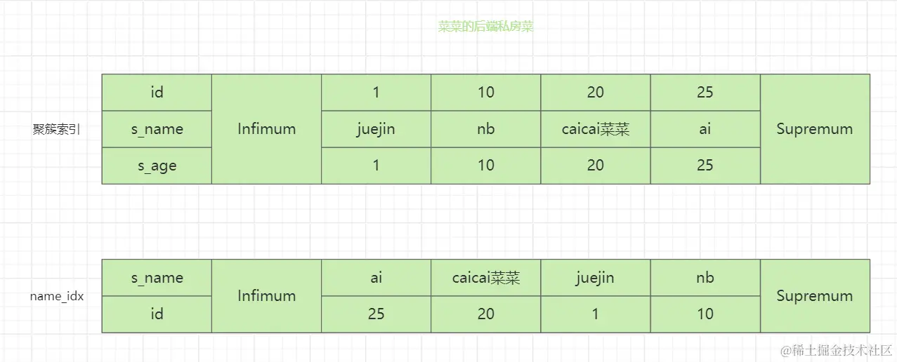​

前面说过GAP需要加在记录之间，如果是第一条记录或者最后一条记录要防止插入，该如何加GAP锁呢？

Infimum和Supremum的出现就能够解决这种问题，它们用于标识每页的最小值和最大值

> 注意：由于RC、RR是常用的隔离级别，案例也是使用这两种隔离级别进行说明

##### 案例：RC、RR下的加锁

||T1|T2|
| :-: | :-------------------------------------------------------------------------------: | :--------------------------------------------------: |
|1|begin;<br />select \* from s where id\>\=10 and id\<\=20 for update;||
|2||insert into s values (12,'caicaiJava',12);<br />(阻塞)|
|3|commit;||

T1事务在10，20之间会加GAP锁，因此T2新增时会被阻塞

​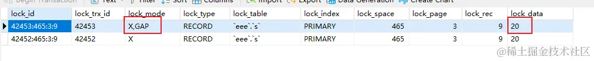​

设置为RC后不再阻塞，因为RC下不加GAP锁不防止插入

```sql
SET SESSION TRANSACTION ISOLATION LEVEL READ COMMITTED;
SELECT @@tx_isolation;
```

但如果是要获取记录锁则还是会被阻塞 （修改id为10的记录 `update s set s_name = '666' where id = 10`​）

​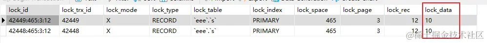​

根据该案例可以说明规则一：**RC及以下使用记录锁、RR及以上使用临键锁**

##### 案例：等值查询

> 等值查询：匹配不到满足条件的记录

||T1|T2|T3|
| ---| :-------------------------------------------------------: | :----------------------------------------------------: | :----------------------------------------------------: |
|1|begin;<br />select \* from s where id\=15 for update;|||
|2||insert into s values (11,'caicaiJava11',11);<br />(阻塞)||
|3|||insert into s values (19,'caicaiJava11',19);<br />(阻塞)|
|4|commit;|||

通过阻塞记录可以看到T2,T3事务被主键索引上数据为20的临键锁（的GAP）阻塞

​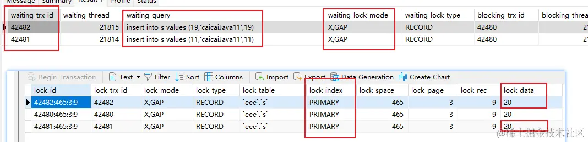​

**等值查询如果匹配不到值会在该区间加GAP锁**

图中向下黑箭头为GAP锁

​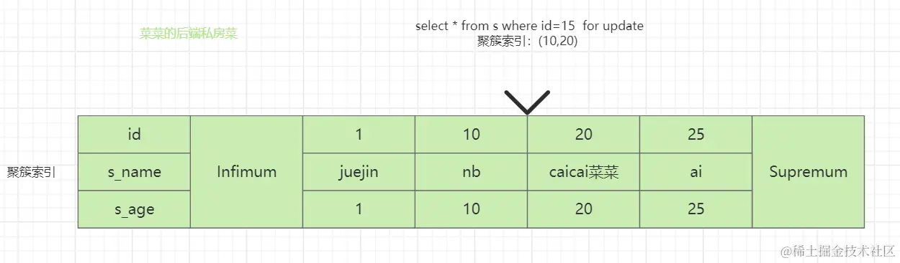​

例如T1等值查询id\=15，没有id\=15的记录则会加锁在15这个区间加GAP锁

> 等值查询：匹配到满足条件的记录

||T1|T2|T3|
| ---| :-------------------------------------------------------: | :----------------------------------------------------------: | :---------------------------------------------------------------------------: |
|1|begin;<br />select \* from s where id\=20 for update;|||
|2||insert into s values (15,'菜菜的后端私房菜',15);<br />(不阻塞)||
|3|||update s set s\_name \= '菜菜的后端私房菜' where id \= 20;<br />(阻塞)|
|4|commit;|||

因为唯一索引上相同的记录只有一条，当等值查询匹配时，临键锁会退化成记录锁，因此T2不被阻塞 T3被阻塞

图中为T3被数据为20上的X锁阻塞

​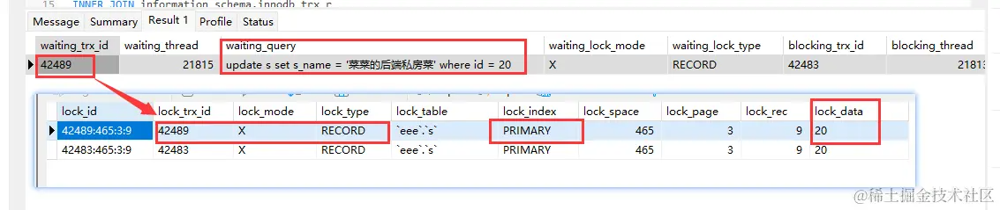​

**唯一索引等值查询间隙锁退化为记录锁**

(图中蓝色为记录锁)

​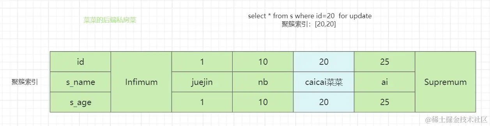​

> 非唯一索引等值查询

||T1|T2|T3|
| ---| :---------------------------------------------------------------------------------: | :------------------------------------------------: | :------------------------------------------: |
|1|begin;<br />select s\_name,id from s where s\_name\='caicai菜菜' for update;|||
|2||insert into s values (15,'bilibili',15);<br />(阻塞)||
|3|||insert into s values (18,'da',18);<br />(阻塞)|
|4|commit;|||

为了确保 `select s_name,id from s where s_name='caicai菜菜' for update`​ 使用s\_name索引，我将查询列换成s\_name上存在的列，避免回表（确保使用s\_name）

1. 先定位到 `s_name='caicai菜菜'`​ 的记录，加锁：(ai,caicai菜菜]
2. 由于不确定满足 `s_name='caicai菜菜'`​ 的记录是否有重复，于是继续后查询，加锁：(caicai菜菜，juejin]
3. 由于juejin不满足查询条件，于是退化为间隙锁，加锁:(caicai菜菜，juejin)

​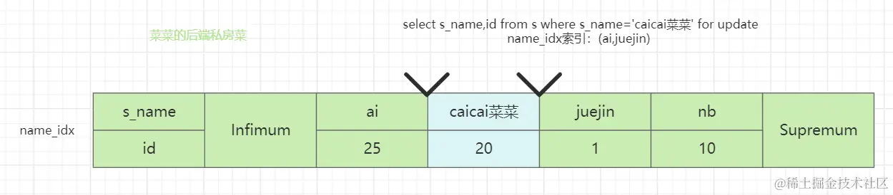​

最终加锁范围 \= (ai,caicai菜菜] + (caicai菜菜，juejin) \= (ai，juejin)

(注意：我这里的加锁范围是简化的，没有带上主键信息；完整信息如下图lock\_data中的juejin,1)

然后再来分析T2,T3的插入语句，首先它们需要在聚簇索引和name\_idx索引上新增数据，由于聚簇索引未加锁，因此不影响插入

但是name\_idx索引上存在锁，T2事务 bilibili 会插入到ai和caicai菜菜记录之间，T3事务会插入到caicai菜菜和juejin这两条记录间，因此被GAP锁阻塞

通过阻塞记录也可以看出T2,T3均被临键锁阻塞

​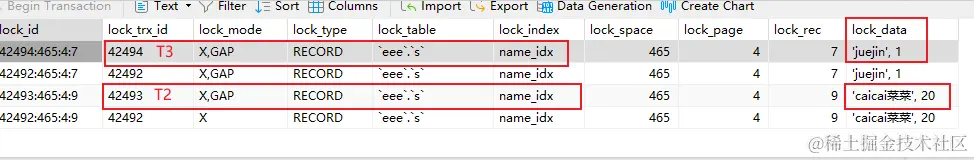​

至此等值查询的案例分析完毕，小结如下：

* **等值查询找不到记录：该区间加GAP锁**
* **等值查询找到记录**

  1. **唯一索引：临键锁会退化为记录锁**
  2. **非唯一索引：一直扫描到第一条不满足条件的记录并将临键锁退化为间隙锁**

##### 案例：范围查询

在上面等值查询 + 非唯一索引的场景下，由于无法判断该值数量，因此会一直扫描，可以把这种场景理解成范围查询

||T1|T2|
| :-: | :-------------------------------------------------------------------------------: | :--------------------------------------------------: |
|1|begin;<br />select \* from s where id\>\=10 and id\<\=20 for update;||
|2||insert into s values (21,'caicaiJava',21);<br />(阻塞)|
|3|commit;||

按照正常思路来说，我的查询条件在10-20，那么就不能往这个范围外再加锁了

但是新增该范围外的记录是会阻塞的（我明明查询条件在10\~20，结果超过20你也给我加锁是吧？）

​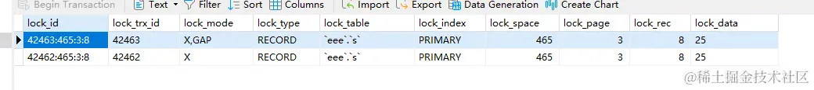​

我们来分析下T1加锁过程： `id>=10 and id<=20`​

1. 定位第一条记录(id\=10)，按道理加间隙锁(前开后闭)应该是(1,10]，但是有等值查询的优化，间隙锁退化为记录锁，因此只对10加锁 [10]
2. 继续向后范围扫描，定位到记录（id\=20），加锁范围(10,20]
3. 按照正常思路主键是唯一的，我已经找到一条20了，那我应该退出才对呀，但是它还是会继续扫描，直到第一条不满足查询条件的值(id\=25)并将临键锁锁退化成间隙锁，也就是不在25加记录锁，因此加锁范围(20,25)

​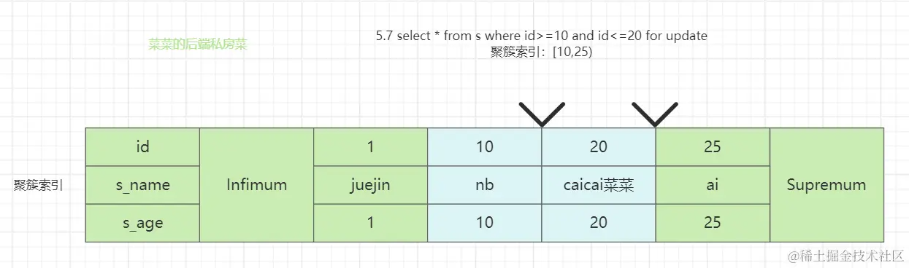​

最终加锁范围 [10] + (10,20] + (20,25) \= [10,25)，因此插入主键为21时会被阻塞

思考：按照正常的思路，当在非唯一索引上时，这么扫描没问题，因为不知道满足结果的20有多少条，只能往后扫描找到第一条不满足条件的记录；而在唯一索引上找到最后一个满足条件的记录20后，还继续往后加锁是不是有点奇怪呢？

我在8.0的版本中重现这个操作，插入id\=21不再被阻塞，应该是在唯一索引上扫描到最终满足条件的记录（id\=20）就结束，加锁范围如下图（在5.7中这应该算bug）

​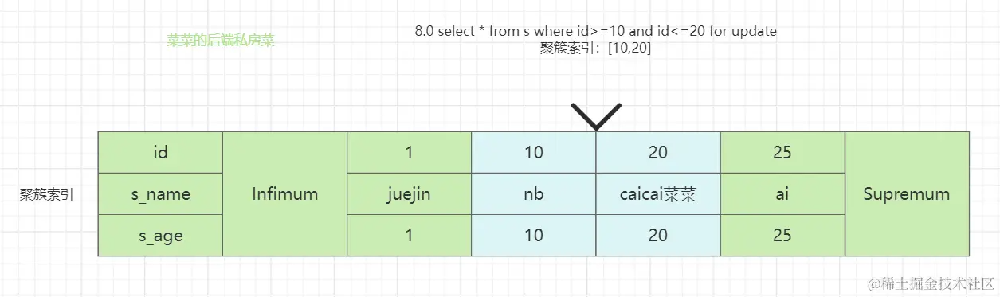​

**范围查询时无论是否唯一索引都会扫描到第一条不满足条件的记录，然后临键锁退化为间隙锁** （8.0修复唯一索引范围查询时的bug）

##### 案例：查找过程中怎么加锁

||T1|T2|
| :-: | :---------------------------------------------------------------------: | :----------------------------------------------------------------------------: |
|1|begin;<br />update s set s\_name \= 'caicai菜菜' where id \= 20;||
|2||select s\_name,id from s where s\_name like 'cai%' for update;<br />(阻塞)|
|3|commit;||

T1 事务在修改时先使用聚簇索引定位到id\=20的记录，修改后通过主键id\=20找到二级索引上的记录进行修改，因此聚簇索引、二级索引上都会获取锁

​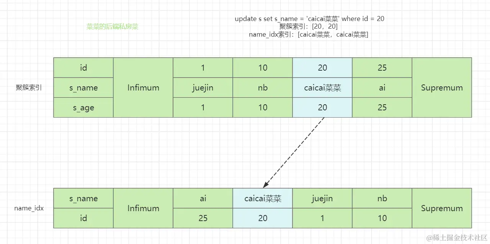​

T2 事务锁定读二级索引时，由于查询条件满足二级索引的值，因此不需要回表，但由于T1事务锁住二级索引上的记录，因此发生阻塞

​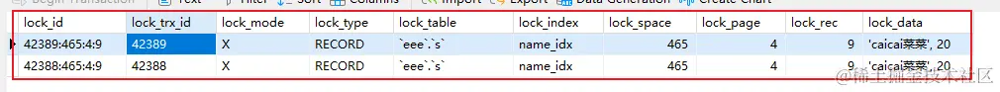​

在该案例中说明：**加锁时使用什么索引就要在那个索引上加锁，遍历到哪些记录就要在哪些记录上加锁**

delete：与主键相关的二级索引肯定也要删除，因此二级索引上对应主键值的记录也会被加锁

update：如果在二级索引上修改，那么一定回去聚簇索引上修改，因此聚簇索引也会被加锁；如果在聚簇索引上修改，二级索引可能会需要被加锁（如上案例，如果修改的是s\_age那么二级索引就不需要加锁）

select：使用什么索引就在什么索引上加锁，比如使用聚簇索引就要在聚簇索引上加锁，使用二级索引就在二级索引上加锁（如果要回表也要在聚簇索引上加锁）

##### 案例：RC、RR什么时候释放锁

RC及以下，RR及以上在获取完锁后，释放锁的时机也不同

> RR下

||T1|T2|T3|
| ---| :---------------------------------------------------------------------------------------------------------------------: | :--------------------------------------------------------: | :------------------------------------------: |
|1|begin;<br />update s force index (name\_idx) set s\_age \= 20 where s\_name \> 'c' and s\_age \> 18;|||
|2||select \* from s where id \= 1 for update;<br />(阻塞)|insert into s values (33,'zz',33);<br />(阻塞)|
|3|commit;|||

T3插入的记录满足 `s_name > 'c' and s_age > 18`​ 的记录被阻塞情有可原

那为啥T2 id\=1不满足 `s_name > 'c' and s_age > 18`​ 也被阻塞了呢？

T1事务是一条修改语句，我使用force index 让它强制使用name\_idx索引，查询条件为 `s_name > 'c' and s_age > 18`​

由于name\_idx上不存在s\_age，需要判断s\_age就要去聚簇索引，因此聚簇索引上也会被加锁

T1在name\_idx上，根据查询条件s\_name \> 'c'进行加锁

1. 定位第一条s\_name大于c的记录，加锁(ai,caicai菜菜]
2. 根据主键值id\=20去聚簇索引中找到该记录，加锁[20,20]
3. 查看是否满足s\_age\>18的条件，如果满足则进行修改（不满足不会释放锁）
4. 继续循环，回到name\_idx上寻找下一条记录（直到不满足查询条件的记录或遍历完记录则退出）

根据1-3的步骤，会在索引上这样加锁

​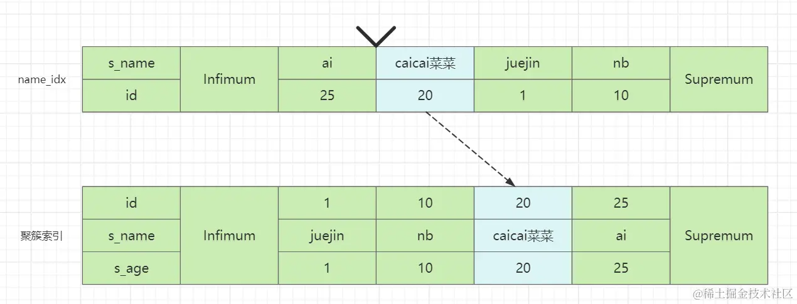​

最终加锁状态：（name\_id中的+∞则指的是supremum）

​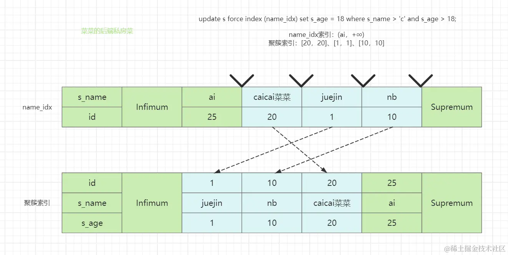​

其中只有id\=20的记录满足 `s_name > 'c' and s_age > 18`​，即使这些记录不满足条件也不会释放锁

因此T2要获取聚簇索引id\=1的记录时被阻塞，而T3则是被supremum阻塞

​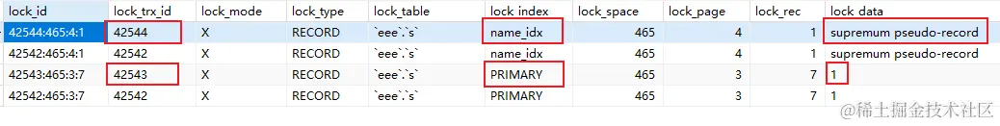​

**在RR下使用的索引遍历到哪就把锁加到哪，即使不满足查询条件也不会释放锁，直到事务提交才释放**

> RC

设置隔离级别

```sql
SET SESSION TRANSACTION ISOLATION LEVEL READ COMMITTED;
SELECT @@tx_isolation;
```

||T1|T2|T3|
| ---| :---------------------------------------------------------------------------------------------------------------------: | :----------------------------------------------------------: | :---------------------------------------------------------: |
|1|begin;<br />update s force index (name\_idx) set s\_age \= 20 where s\_name \> 'c' and s\_age \> 18;|||
|2||select \* from s where id \= 1 for update;<br />(不阻塞)|select \* from s where id \= 20 for update;<br />(阻塞)|
|3|commit;|||

遍历流程与RR情况相似，不同的是RC只加记录锁，并且不满足条件的记录会立即释放锁，因此T2不被阻塞，满足条件的T3被阻塞

​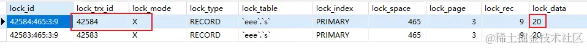​

加锁如下图

​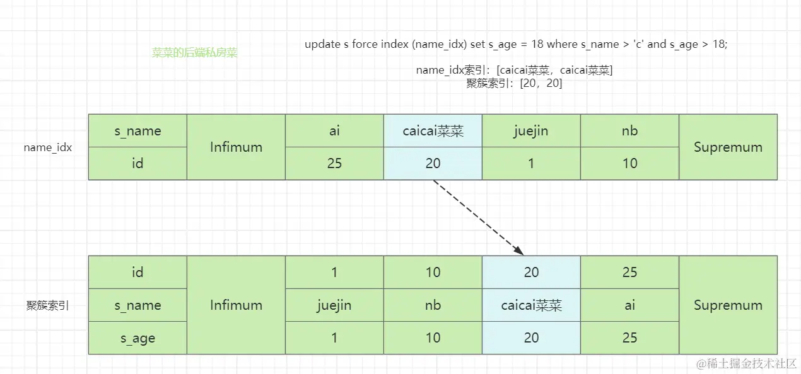​

**遍历到哪条记录就先加锁，但是RC对于不满足查询条件的记录会释放锁**

#### 死锁案例分析

死锁案例分析的是insert加的锁，配合上面新增加锁规则查看

##### 案例：新增死锁

先将name\_idx改为唯一索引

||T1|T2|
| :-: | :----------------------------------------------: | :----------------------------------------------: |
|1|begin;<br />insert into s values (5,'bilibili',5);||
|2||insert into s values (7,'bilibili',7);<br />(阻塞)|
|3|insert into s values (6,'balibali',6);||
|4||死锁 回滚|

T1插入bilibili，T2也插入bilibili，按照道理应该报错唯一键重复呀，T2怎么阻塞了呢？

T1后续再插入balibali竟然发生死锁了！啥情况呀？同学们可以先根据前面说到的insert加锁规则，大胆猜测喔\~

> 查看最近的死锁日志

需要注意的是innodb lock表中锁相关信息记录只有正在发生时才存在，像这种发生死锁，回滚事务后是看不到的，因此我们来看看死锁日志

show engine innodb status 查看innodb状态，其中有一段最近检测到的死锁 latest detected deadlock

红色框表示事务和持有/等待的锁

绿色框表示锁的信息（都是同一把X锁）

​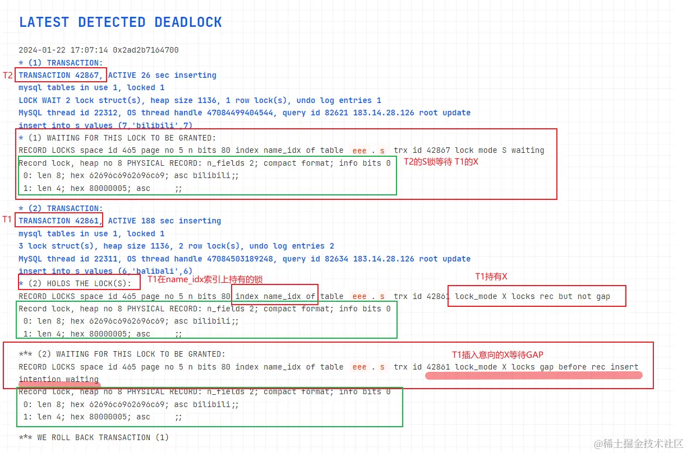​

如果日志还是看不太懂的话，来看看下面这段分析吧（主要说name\_idx索引上的流程哈）

1、T1插入bilibili（隐式锁）

2、T2插入bilibili发生冲突，T2帮T1生成锁结构（隐式锁转化为显示锁，T1获得X record），T2要加S临键锁，先获取GAP锁（成功），再获取S锁（被T1的X record阻塞）

T1事务id为42861，T2事务id为42867：根据锁信息可以看到T2想加的S锁被T1的X锁阻塞

​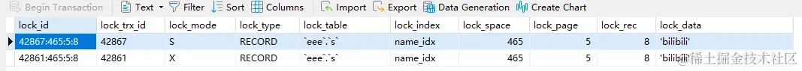​

3、T1插入balibali，插入意向锁被T2的GAP锁阻塞（死锁成环：T1等待T2的GAP，T2等待T1的X）

图中蓝色与T1有关，黑色与T2有关

T1：持有[bilibili，bilibili] X锁，要插入balabala被T2的间隙锁（ai,bilibili）阻塞

T2：持有间隙锁（ai,bilibili），要插入[bilibili，bilibili]S锁被T1的[bilibili，bilibili]X锁阻塞

​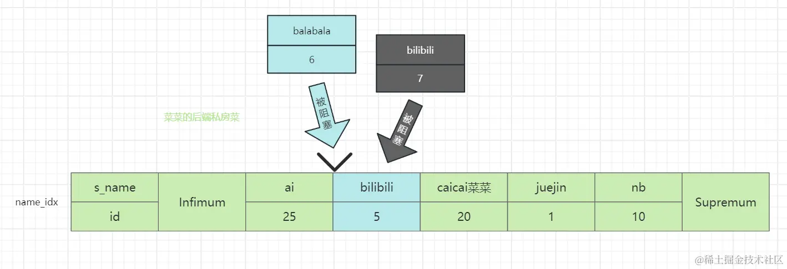​

那么如何解决死锁呢？

先来看看死锁产生的四个条件：**互斥、占有资源不放、占有资源继续申请资源、等待资源成环**

MySQL通过回滚事务的方式解决死锁，也就是解决占有资源不放

但MySQL死锁检测是非常耗费CPU的，为了避免死锁检测，我们应该在业务层面防止死锁产生

首先互斥、占有资源不放两个条件是无法破坏的，因为加锁由MySQL来实现

而破坏占有资源继续申请资源的代价可能会很大，比如：让业务层加锁处理

性价比最高的应该是破坏等待资源成环，**当发生死锁时，通过分析日志、加锁规则，调整业务代码获取资源的顺序避免发生死锁**

##### 案例：相同的新增发生死锁

||T1|T2|T3|
| ---| :------------------------------------: | :--------------------------------------------: | :--------------------------------------------: |
|1|insert into s values (15,'bili',15);|||
|2||insert into s values (15,'bili',15);<br />(阻塞)|insert into s values (15,'bili',15);<br />(阻塞)|
|3|rollback；|||
|4|||死锁|

T1、T2、T3新增相同的记录

T1新增后，T2、T3 会帮T1生成锁结构X锁从而被阻塞

当T1回滚时，T2��T3竟然发生死锁？

> 分析流程

1. T1 插入 加隐式锁
2. T2 插入相同唯一记录，帮T1生成X锁，自己获取S next key，先获取gap（成功），再获取S record（此时被T1的X锁阻塞）；T3 与 T2 相似，获取到gap 再获取S record 时被T1的X阻塞
3. T1 回滚，T2、T3获取S record成功，此时它们都还要获取X record（插入意向锁转化为显示锁X）导致死锁成环（T2要加X锁被T3的GAP阻塞，T3要加X锁被T2的GAP阻塞）

图中T2、T3都对bili加S next key锁（橙色记录和前面的黑色间隙），当它们都想加插入意向X锁（蓝色记录），同时也被各自的GAP锁阻塞

​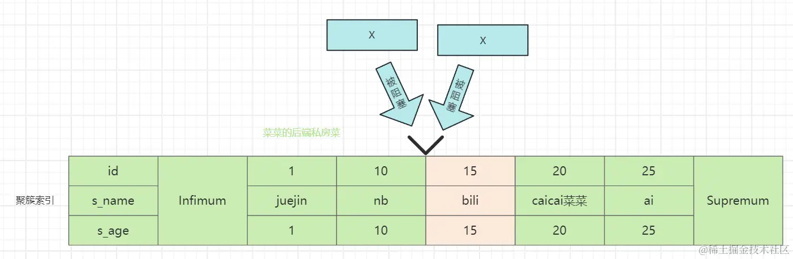​

> 查看死锁日志

​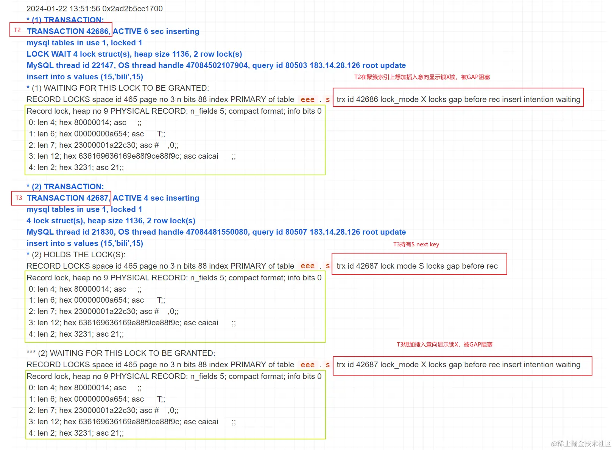​

#### 加锁总结

update、delete 先查再改，可以看成锁定读，insert则是有单独一套加锁规则

> 锁定读加锁规则

**在RC及以下隔离级别，锁定读使用record锁；在RR及以上隔离级别，锁定读使用next key锁**

**等值查询：如果找不到记录，该查询条件所在区间加GAP锁；如果找到记录，唯一索引临键锁退化为记录锁，非唯一索引需要扫描到第一条不满足条件的记录，最后临键锁退化为间隙锁（不在最后一条不满足条件的记录上加记录锁）**

**范围查询：非唯一索引需要扫描到第一条不满足条件的记录**（5.7中唯一索引也会扫描第一条不满足条件的记录8.0修复，后文描述）

**在查找的过程中，使用到什么索引就在那个索引上加锁，遍历到哪条记录就给哪条先加锁**

**在RC及以下隔离级别下，查找过程中如果记录不满足当前查询条件则会释放锁；在RR及以上无论是否满足查询条件，只要遍历过记录就会加锁，直到事务提交才释放**

> insert加锁规则

**正常情况下加锁：**

1. **一般情况下，插入使用隐式锁（插入意向锁），不生成锁结构**
2. **当插入意向锁（隐式锁）被其他事务生成锁结构时变为显示锁（X record）**

**重复冲突加锁：**

1. **当insert遇到重复主键冲突时，RC及以下加S record，RR及以上加S next key**
2. **当insert遇到重复唯一二级索引时，加S next key**

**如果使用**​**​`ON DUPLICATE KEY update`​**​**那么S锁会换成X锁**

外键加锁：一般不做物理外键，略...

#### 死锁产生条件

* 互斥
* 请求与保持
* 环路等待
* 不可剥夺

#### 避免死锁

* 以固定的顺序访问表和行
* 在同一个事务中，尽可能做到一次锁定所需要的所有资源
* 避免大事务，将大事务拆成多个小事务
* 尽量用主键查询数据

#### MySQL中死锁如何解决呢？

* 锁超时机制：事务/线程在等待锁时，超出一定时间后自动放弃等待并返回。

  * 默认的锁超时时间是`50s`​
  * 但实际业务中，`50s`​时间太长了，会导致越来越多的事务阻塞
  * 如果调小`等待锁时间`​参数，会容易误伤友军
* 外力介入打破僵局：第三者介入，将死锁情况中的某个事务/线程强制结束，让其他事务继续执行。

#### Mysql是如何发现死锁的呢？

##### 死锁检测算法 - wait-for graph

​`wait-for graph`​算法被启用后，会要求`MySQL`​收集两个信息：

* 锁的信息链表：目前持有每个锁的事务是谁。
* 事务等待链表：阻塞的事务要等待的锁是谁。

套个例子来理解，好比目前库中有`T1、T2、T3`​三个事务、有`X1、X2、X3`​三个锁，事务与锁的关系如下：

​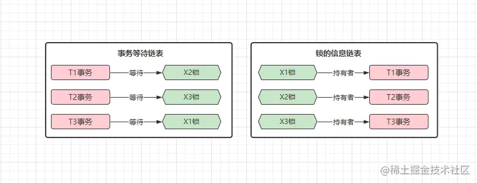​

此时当`T3`​事务需要阻塞等待获取`X1`​锁时，就会触发一次`wait-for graph`​算法，流程如下：

* ①先根据`T3`​要获取的`X1`​锁，在「锁的信息链表」中找到`X1`​锁的持有者`T1`​。
* ②再在「事务等待链表」中查找，看看`T1`​是否在等待获取其他锁，此时会得知`T1`​等待`X2`​。
* ③再去「锁的信息链表」中找到`X2`​锁的持有者`T2`​，再看看`T2`​是否在阻塞等待获取其他锁。
* ④再在「事务等待链表」中查找`T2`​，发现`T2`​正在等待获取`X3`​锁，再找`X3`​锁的持有者。

经过上述一系列算法过程后，最终会发现`X3`​锁的持有者为`T3`​，而本次算法又正是`T3`​事务触发的，此时又回到了`T3`​事务，也就代表着产生了“闭环”，因此也可以证明这里出现了死锁现象，所以`MySQL`​会强制回滚其中的一个事务，来抵达解除死锁的目的。

> 但出现死锁问题时，`MySQL`​会选择哪个事务回滚呢？之前分析过，当一个事务在执行`SQL`​更改数据时，都会记录在`Undo-log`​日志中，`Undo`​量越小的事务，代表它对数据的更改越少，同时回滚的代价最低，因此会选择`Undo`​量最小的事务回滚（如若两个事务的`Undo`​量相同，会选择回滚触发死锁的事务）。

### MVCC 多版本控制

MVCC 全称 Multi-Version Concurrency Control（多版本并发控制），在数据库管理系统中通过保存**数据的多个版本**来**避免读写冲突**，从而提高并发处理能力。

#### 数据的多版本

每个DML操作在更新数据页之前，InnoDB会先将数据当前的状态记录在「**Undo Log**」中。

既然这样，那么读事务直接读取这里的数据不就好了？这样的话，写事务在处理过程中，读事务既不需要排队等待，又能读取到除当前写事务之外最新的数据状态，也避免了因写事务的回滚而造成的“脏读”问题。如下图。

​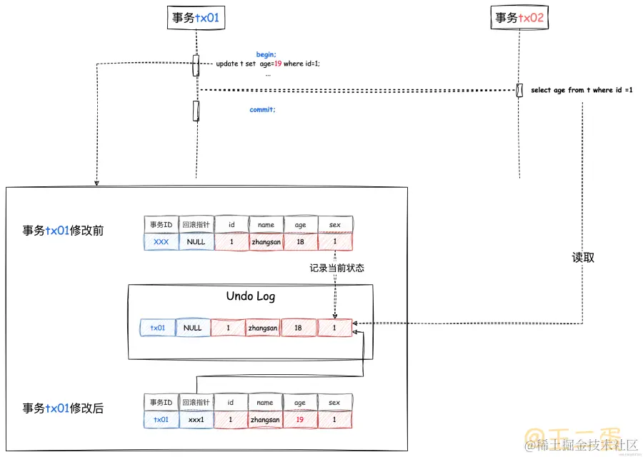​

在并发事务中如果有多个写事务，那么**Undo Log**是这样的：

​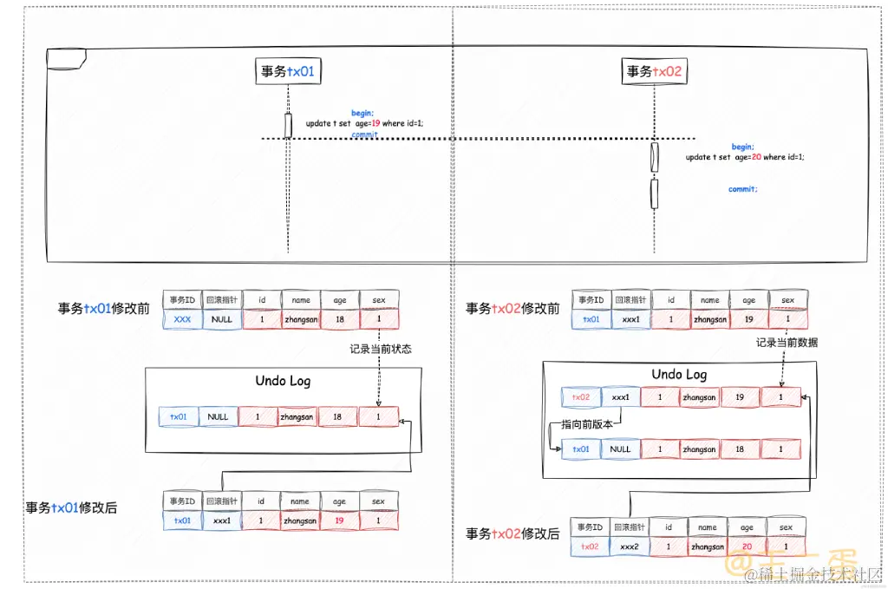​

图中的「**事务ID**」和「**回滚指针**」是行数据中包含的「**隐藏字段**」，在 Undo Log 中通过回滚指针进行串联的数据就是指MVCC的「**多版本**」。

（这里说明下，同时执行DML操作时还是会使用锁来控制的，不会减少对锁的竞争。所以图中有个先后顺序。）

#### 实现原理

##### 隐藏字段

建一张表，除了声明的字段，还会有额外隐藏字段

* DB_ROW_ID 隐藏主键
* Deleted_Bit 删除标识
* TRX_ID 最新事务 ID
* ROLL_PTR 回滚指针
* ​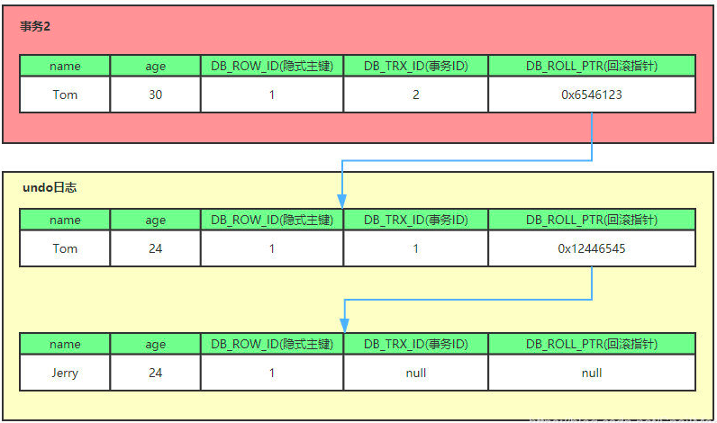​

##### undo log

* 回滚指针使 undo log 成为一条链表

##### Read View

###### 核心四参数

* creator_trx_id

  * 创建当前 readview 的事务 id
* trx_ids

  * 生成 readview 时，所有的活跃事务 id
* up_limit_id

  * 记录 trx_list 列表中事务 ID 最小的 ID
* low_limit_id

  * 生成当前 readview 时，下一个事务分配的 id

###### readview 可见性算法

* DB_TRX_ID < up_limit_id

  * 表明生成该版本的事务在生成 Read View 前，已经提交(因为事务 ID 是递增的)，所以该版本可以被当前事务访问
* DB_TRX_ID >= low_limit_id

  * 代表 DB_TRX_ID 所在的记录在 Read View 生成后才出现的，那对当前事务肯定不可见
* up_limit_id <= DB_TRX_ID < low_limit_id

  * trx_list.contains(DB_TRX_ID) && DB_TRX_ID == creator_trx_id

    * 代表 Read View 生成时刻，这个事务还未提交，且数据是自己生成的，可见
  * trx_list.contains(DB_TRX_ID) && DB_TRX_ID != creator_trx_id

    * 代表 Read View 生成时刻，这个事务还未提交，但数据不是自己生成的，不可见
  * ！trx_list.contains(DB_TRX_ID)

    * 这个事务在 Read View 生成之前 就已经提交了，修改的结果，当前事务是能看见的

#### 案例说明

接下来，通过一张图具体看一下Read View怎么判断的。

​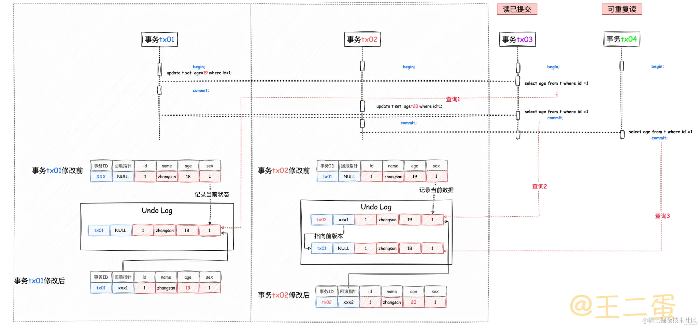​

图中有4个并发事务，并且在同一时刻开启了事务。

1. 查询1是事务tx03在事务tx01已修改未提交时进行查询，事务tx02的update还未开始执行，所以当前数据的事务ID=tx01，活跃的事务ID为[tx01、tx02、tx03、tx04]，按照Read View的逻辑：

    * tx01 不小于 up_limit_id（tx01），所以当前行记录age=19不可见。
    * tx01 大于等于 up_limit_id（tx01） 且小于 low_limit_id（tx05），可以读取上个已提交（XXX）的数据，也就是age=18。
2. 查询2是事务tx03在事务tx01已提交，事务tx02已修改未提交时进行查询，所以当前数据的事务ID=tx02，活跃的事务ID为[tx02、tx03、tx04]，按照Read View的逻辑：

    * tx02 不小于 up_limit_id（tx02），所以当前行记录age=20不可见。
    * tx02 大于等于 up_limit_id（tx02） 且小于 low_limit_id（tx05），可以读取上个已提交（tx01）的数据，也就是age=19。
3. 查询3是事务tx04在事务tx02已提交时进行查询，所以当前数据的事务ID=tx02，由于是可重复读，所以在事务开始就生成了活跃的事务ID[tx01、tx02、tx03、tx04]，按照Read View的逻辑：

    * tx02 不小于 up_limit_id（tx01），所以当前行记录age=20不可见。
    * tx02 大于等于 up_limit_id（tx01） 且小于 low_limit_id（tx05），可以读取上个已提交（XXX）的数据，也就是age=18。

#### RC、RR 不同级别下的 MVCC 机制

* RC 读已提交(READ-COMMITTED)

  * 读操作使用 MVCC 机制，每次 SELECT 生成快照，写操作加排他锁
* RR 可重复读(REPEATABLE-READ)

  * 读操作使用 MVCC 机制，首次 SELECT 生成快照，写操作加临键锁
  * 之后的快照读使用的都是同一个 Read View，所以对之后的修改不可见

### MySQL是如何保证数据不丢失的

#### Buffer Pool 和 DML 的关系

InnoDB中的「**Buffer Pool**」除了在查询时起到提高效率作用，同样，在insert、update、delete这些DML操作时为了减少和磁盘的频繁交互，也会将这些更新先在Buffer Pool中缓存的数据页进行操作，随后将这些有更新的「**脏页**」刷到磁盘中。

这个时候就涉及到一个问题：如果MySQL服务宕机了，这些在内存中更新的数据会不会丢失？

答案是一定会存在丢失现象的，只不过MySQL做到了尽量不让数据丢失。接下来来看一下MySQL是怎么做的。

这里还是把结构图贴一下，方便下面介绍时看图理解。

​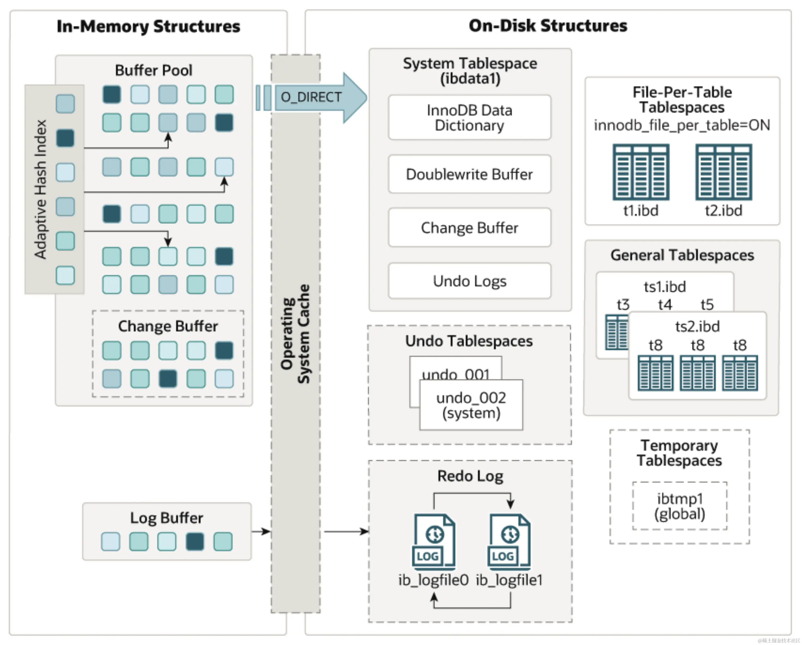​

#### DML操作流程

##### 加载数据页

行记录是在数据页中，所以，当InnoDB接收到DML操作请求后，还是会去找「**数据页**」，查找的过程跟上文查询行记录流程是一样。这里说一下，insert的请求会根据主键索引去找数据页，update、delete根据查询条件去找数据页，总之「**数据页**」要加载到「**Buffer Pool**」之后才会进行下一步操作。

##### 更新记录

定位到数据页后，insert操作就是往数据页中添加一行记录，delete是标记一下行记录的‘删除标记’，而update则是先删除再添加，这是因为存在可变长的字段类型，比如varchar，每次更新时，这种类型的数据占用内存是不固定的，所以先删除再添加。

这里的删除标记是行记录的字段，也就是除了业务字段数据，InnoDB默认为每行记录添加的字段，所以一个行记录大概如下图，这也是之前提到过的「**行格式**」。

​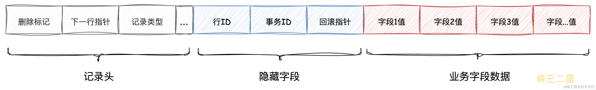​

找到数据页并且更新记录之后DML操作就算完成了，但是还没有落地到磁盘。

> 这个时候直接刷新到磁盘视为完成不可以吗？

#### 数据持久化方案

可以是可以，但是如果每次的DML操作都要将一个16KB的数据页刷到磁盘，其效率是极低的，估计也就没有人用MySQL了。但是如果不刷新到磁盘，就会发生MySQL服务宕机数据会丢失现象。MySQL在这里的处理方案是：

1. 等待合适的时机将批量的「**脏页**」异步刷新到磁盘。
2. 先快速将更新的记录以日志的形式刷新到磁盘。

先看第一点，什么时候是合适的时机？

##### 合适的时机刷盘

当「**脏页**」在「**Buffer Pool**」中达到某个阈值的时候，InnoDB会将这些脏页刷新到磁盘中。这个阈值可以通过 `innodb_max_dirty_pages_pct`​ 这个参数查看或设置，相关命令如下：

```sql
-- 查看脏页刷新阈值
show variables like 'innodb_max_dirty_pages_pct'
-- 在线设置脏页刷新阈值，当脏页在Buffer Pool占用70%的时候刷新
SET GLOBAL innodb_max_dirty_pages_pct = 70
```

当然，这个合适的时机只是为了减少与磁盘的交互，用来提高性能的，并不能确保数据不丢失。

##### 双写机制

在刷新「**脏页**」这里还有一个非常重要的注意事项就是：因为InnoDB的页大小为16KB，而一般操作系统的页大小为4KB。意味着InnoDB将这些「**脏页**」向磁盘刷新时，在操作系统层面会被分成4个4KB的页，这样的话，如果其中有一页因为MySQL宕机或者其他异常导致没有成功刷新到磁盘，就会出现「**页损坏现象**」，数据也就不完整了。

​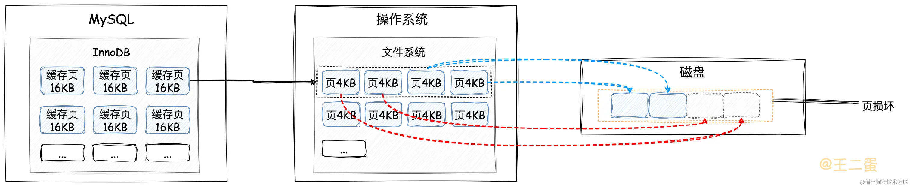​

所以InnoDB在这里采用的双写机制，在将这些「**脏页**」刷新到磁盘之前先会往结构图中的「**Doublewrite Buffer**」中写入，随后再刷新到对应的表空间中，当出现故障时就可以通过双写缓冲区进行恢复。

> 向「Doublewrite Buffer」就不会发生「页损坏现象」？

「**Doublewrite Buffer**」的大小是独立且固定的，不是基于页的大小来划分的。所以不受操作系统中的页大小限制，也不会发生「**页损坏现象**」。并且先以顺序IO的方式向「**Doublewrite Buffer**」写入数据页，再以随机IO异步刷新到表空间这种方式还可以提高写入性能。

​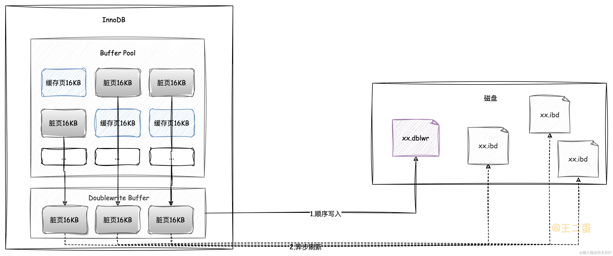​

再看第二点，为什么以日志的形式先刷新到磁盘？

##### 日志先行机制

在「**Buffer Pool**」中更新完数据页后，由于不会及时将这些「**脏页**」刷新到磁盘，为了避免数据丢失，会将本次的DML操作向「**Log Buffer**」中写一份并且刷新到磁盘中，相比16KB的数据页来说，这个数据量会小很多，而且写入日志文件时是追加操作，属于顺序IO，效率较高。如下图，哪种方式写入效率更高是显而易见的。

​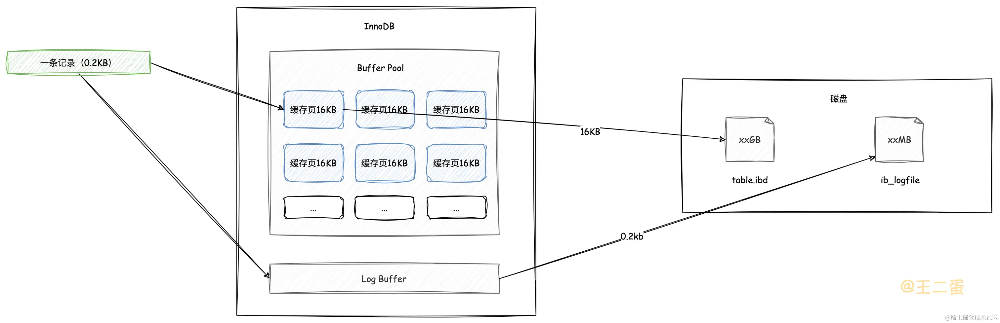​

这里说的日志文件就是经常会听到的「**Redo Log**」，即使MySQL宕机了，通过磁盘的redolog，也可以在MySQL启动时尽可能的将数据恢复到宕机之前样子。当然，还有「**Undo Log**」，因为对本文重点没有直接影响，所以不对此展开说明。

这种日志先行（WAL）的机制也是MySQL用于提高效率和保障数据可靠的一种方式。

> 为什么是尽可能的恢复？

##### 日志刷盘机制

因为「**Log Buffer**」中的日志数据什么时候向磁盘刷新则是由 `innodb_flush_log_at_trx_commit`​ 和 `innodb_flush_log_at_timeout`​ 这两个参数决定的。

* ​`innodb_flush_log_at_trx_commit`​默认为1，也就是每次事务提交后就会刷新到磁盘。
* 当`innodb_flush_log_at_trx_commit`​设置为0时，则不会根据事务提交来刷新，而是根据`innodb_flush_log_at_timeout`​设置的时间定时刷新，这个时间默认为1秒。
* 当`innodb_flush_log_at_trx_commit`​设置为2时，仅将日志写入操作系统中的缓存中，随后跟随根据`innodb_flush_log_at_timeout`​定时刷新。

**注意：如果在**​**​`innodb_flush_log_at_timeout`​**​**内没有发生事务提交，也会刷新到磁盘。**

如果在MySQL服务宕机的时候，「**Log Buffer**」中的日志没有刷新到磁盘，这部分数据也是会丢失的，在重启后也不会恢复。所以如果不想丢失数据，在性能还可以的情况下，尽量将`innodb_flush_log_at_trx_commit`​设置为1。

> 「redo log」是怎么恢复数据的？

##### Redo Log 恢复数据

首先，redo log会记录DML的操作类型、数据的表空间、数据页以及具体修改的内容，以 `insert into t1(1,'hi')`​为例，对应的redo log内容大概这样的

​​

假如 `innodb_flush_log_at_trx_commit`​ 的值为1，那么当该DML操作事务提交后，就会将 redo log 刷新到磁盘。成功刷新到磁盘后，就可以视为数据被写入成功。

此时如果「**脏页**」还没刷新到磁盘便宕机，那么在下次MySQL启动时便去加载redo log，如果redo log存在数据则意味着需要恢复数据。这个时候就可以通过redo log中的内容重新构建「**脏页**」，从而恢复到宕机之前的状态。

> 怎么构建「**脏页**」呢？

其实在每次的redo log写入时都会记录一个「**LSN（log sequence number）** 」，同时这个值在「**数据页**」中记录最后一次被修改的日志序列位置。MySQL在启动时通过LSN来对比 redo log 和数据页，如果数据页中的LSN小于 redo log 的LSN，则会将该数据页加载到「**Buffer Pool**」，然后根据 redo log 的内容构建出「**脏页**」，等待下次刷新到磁盘，数据也就恢复了。如下图

​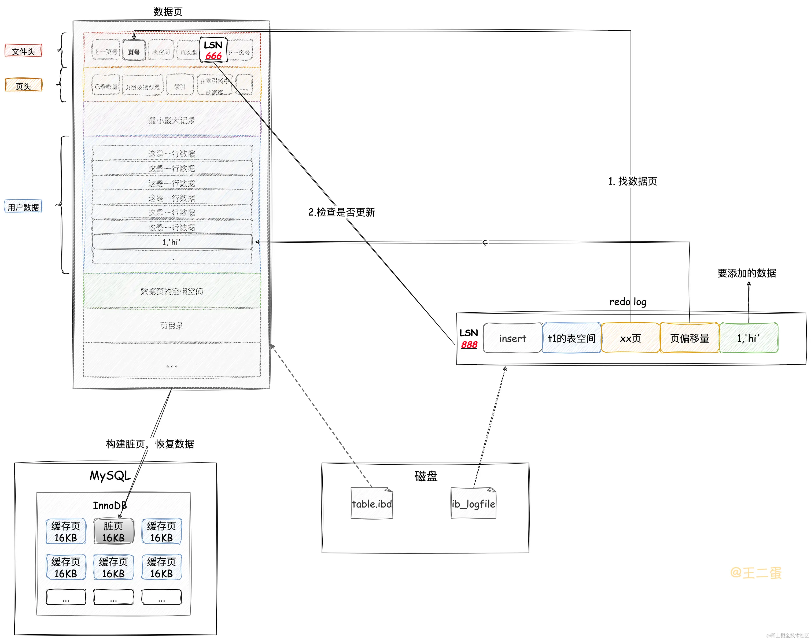​

**注意：这个恢复的过程重点在redo上，实际上还涉及到「Change Buffer」、「Undo Log」等操作，这里没有展开说明。**

> 「Doublewrite Buffer」和「redo log」都是恢复数据的，不冲突吗？

不冲突，「**Doublewrite Buffer**」是对「**页损坏现象**」的整个数据页进行恢复，Redo Log只能对某次的DML操作进行恢复。

##### binlog redolog 两阶段提交

​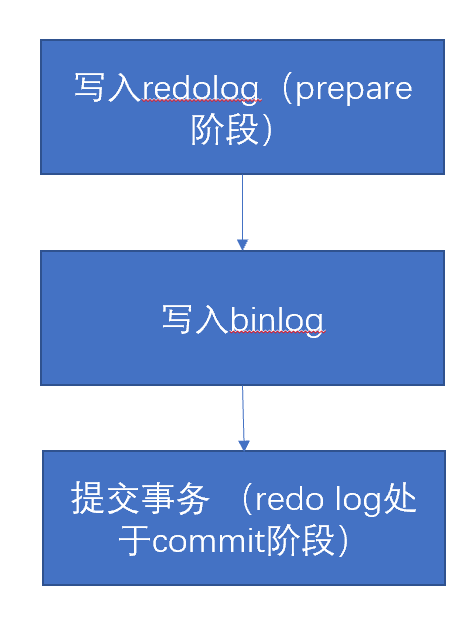​

为了保证`binlog`​和`redolog`​的数据一致性，MySQL采用`两阶段提交`​，此时`binlog`​和`redolog`​的刷盘策略必须设置为**双1**。，如果不设置双1的话，`redolog`​和`binlog`​都是各自写各自的，有可能会`redolog`​刷盘了，而`binlog`​没有刷盘或者`redolog`​没有刷盘，而`binlog`​刷盘了，无法确定是否一致。

两阶段提交的话，先写`redolog`​后写`binlog`​，如果`binlog`​没有写完则回滚`redolog`​，如果`binlog`​写完了则提交`redolog`​的事务。

1、首先写入`redo log`​，写完后，`redolog`​处于`prepare`​阶段  
2、写入`binlog`​  
3、提交事务，将`redo log`​转化为`commit`​阶段

具体的原理如下：

1. 当`redolog`​没有写完后，系统崩溃。此时，当重放`redo log`​时，没有检测到`prepare`​标记，会回滚事务。此时`binlog`​也没有写入，二者数据保持一致。
2. 当`redolog`​写入`prepare`​标记后，还未写完`binlog`​时系统崩溃。此时也会回滚事务。二者的数据保持一致。
3. 当`binlog`​也写完后，事务提交时系统崩溃，此时需要查看`redolog`​是否写完整，如果`redolog`​有`commit`​标记，则提交事务。如果`redolog`​没有`commit`​标记，则要查看`binlog`​对应的`commit`​标记，如果`binlog`​有`commit`​标记，则提交事务，如果没有`commit`​标记则回滚事务。二者的数据仍保持一致。

​`binlog`​和`redolog`​通过`XID`​来进行绑定，通过`XID`​来查询对应的`redolog`​和`binlog`​。

#### 总结

> 写sql执行过程：
>
> * sql 发送给 sql 接口，对 sql 进行 hash 处理
> * sql 接口根据 hash 值检索是否有缓存，如果有，对应缓存删掉
> * SQL 交给解析器，校验 sql 是否正确
> * 优化器制定执行计划
> * 在执行开始之前，先记录一下 undo-log 日志和 redo-log(prepare 状态)日志
> * 在缓冲区中查找是否存在数据
>
>   * 存在，对缓冲区进行写操作，利用 checkpoint 机制刷盘
>   * 不在，调用存储引擎
> * 写操作完成后，记录 bin-log 日志，同时将 redo-log 日志中的记录改为 commit 状态
> * 将 SQL 执行耗时及操作成功的结果返回给 SQL 接口，再由 SQL 接口返回给客户端

InnoDB通过以上的操作可以尽可能的保证MySQL不丢失数据，最后再总结一下MySQL是如何保障数据不丢失的：

1. 为了避免频繁与磁盘交互，每次DML操作先在「**Buffer Pool**」中的缓存页中执行，缓存页有更新之后便成为「**脏页**」，随后根据`innodb_max_dirty_pages_pct`​这个参数将「**脏页**」刷新到磁盘。
2. 因为「**脏页**」在刷新到磁盘之前可能会存在MySQL宕机等异常行为导致数据丢失，所以MySQL采用日志先行（WAL）机制，将DML操作以日志的形式进行记录到「**Redo Log**」中，随后根据`innodb_flush_log_at_trx_commit`​ 和 `innodb_flush_log_at_timeout`​这两个参数将「**Redo Log**」刷新到磁盘，以便恢复。
3. 在向磁盘刷新「**脏页**」时，为了避免发生「**页损坏**」现象，InnoDB采用双写机制，先将这些脏页顺序写入「**Doublewrite Buffer**」中，随后再将数据页异步刷新到各个表空间中，这种方式既能提高写入效率，又可以保障数据的完整性。
4. 如果在「**脏页**」刷新到磁盘之前，MySQL宕机了，那么会在下次启动时通过 redo log 将脏页构建出来，做到数据恢复。
5. 通过以上步骤，MySQL做到了尽可能的不丢失数据。

### 日志

#### slow query log

执行时间超过 `long_query_time`​ 秒钟的查询，解决 SQL 慢查询问题的时候会用到。

#### error log

对 MySQL 的启动、运行、关闭过程进行了记录。

#### undo log 回滚日志

> 实现事务回滚  
> 基于 Undo 版本链实现 MVCC

* 如果是 insert，则生成 delete 操作
* 如果是 delete，则是将 deleted_bit 设为 0
* 如果是 update，则是更新为原来的数据

#### redo log 重做日志

> redo log 也是先写内存，后刷盘

* Redo-log 的刷盘策略

  * 间隔一段时间，刷日志到磁盘
  * 每次提交事务
  * 有事务提交，并且间隔 1s
* 日志格式

​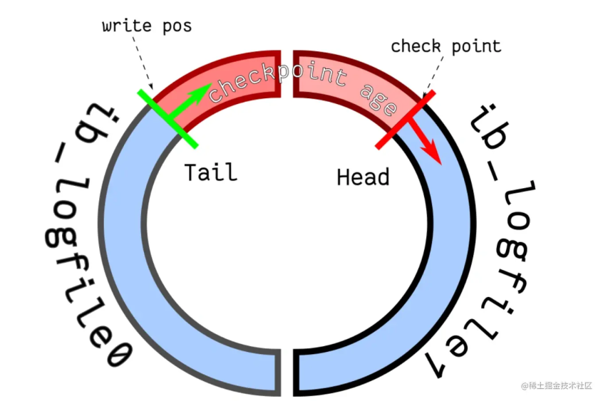​

> * 用两个日志文件组成一个环形

* write pos

  * 记录写到了哪里
* check point

  * 记录哪些 Redo-log 记录已经失效

两根指针中间区域，也就是图中的红色区域，代表是可以写入日志记录的可用空间，而蓝色区域则表示日志落盘但数据还未落盘的记录。

* 两阶段提交

  * 生成 redo log(prepare 状态)，并生成 undo log，执行 sql，将数据更新到 BufferPool 缓冲区中，生成 bin log
  * 遇到 rollback，在 undo log 中找到撤销 sql 执行，将缓冲区数据还原
  * 遇到 commit，redo log 改为 commit 状态，异步刷盘

#### relay log 中继日志

* 在主从同步的时候使用到，它是一个临时的日志文件，用于存储从 master 节点同步过来的 binlog 日志内容
* 主要为了区别主库和从库产生的日志

#### binlog 二进制日志

* 使用场景

  * 主从复制
  * 数据恢复
* 刷盘机制

  * 每次提交事务的时
  * 每 N 个事务提交
  * 系统自行判断
* 日志格式

  * statment

    * 每一条会修改数据的 sql 都会被记录在 binlog 中，如 inserts, updates, deletes
    * 不需要记录每一行的变化，减少了 binlog 日志量
    * 在某些情况下会导致主从数据不一致，比如执行 sysdate()、now()
  * row

    * 仅需记录哪条数据被修改
    * 会产生大量的日志
  * mixed
* redo log 和 bin log 区别

  * Redo-log 是 InnoDB 专享的，Bin-log 是所有引擎通用的
  * Redo-log 是用两个文件循环写，而 Bin-log 是不断创建新文件追加写
  * Redo-log 中记录的都是变更后的数据，而 Bin-log 会记录变更 SQL 语句
  * Redo-log 主要实现故障情况下的数据恢复，Bin-log 则用于数据灾备、同步

### 主从同步

​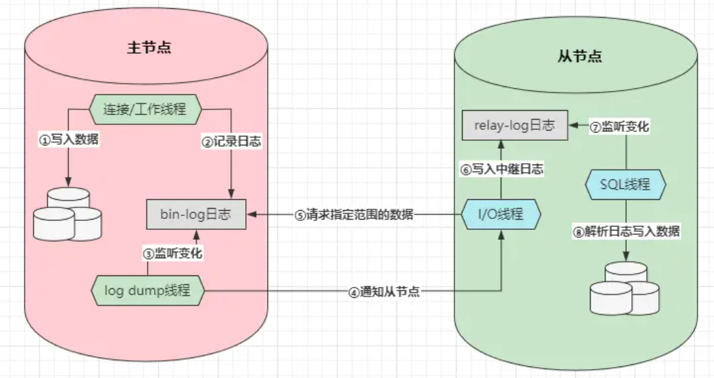​

* 客户端将写入数据的需求交给主节点，主节点先向自身写入数据
* 数据写入完成后，紧接着会再去记录一份 Bin-log
* 主节点上的专门监听 Bin-log 日志的 log dump 线程，监听到日志发生变更时，会通知从节点来拉取数据
* 从节点会有专门的 I/O 线程用于等待主节点的通知，当收到通知时会去请求一定范围的数据
* 当从节点在主节点上请求到一定数据后，接着会将得到的数据写入到 relay-log 中继日志
* 从节点上也会有专门负责监听 relay-log 变更的 SQL 线程，当日志出现变更时会开始工作
* 中继日志出现变更后，接着会从中读取日志记录，然后解析日志并将数据写入到自身磁盘中

### 主从延迟

#### 计算公式

> 主备延迟时间计算公式： t3 - t1

* 主库完成一个事务，写入 binlog。binlog 中有一个时间字段，用于记录主库写入的时间【时刻 t1】
* binlog 同步给备库，备库接收并存储到中继日志 【时刻 t2】
* 备库 SQL 执行线程执行 binlog，数据写入到备库表中 【时刻 t3】

#### 排查方法

* ​`show slave status `​

  * seconds_behind_master，表示当前备库延迟了多少秒
* 比较主从库的文件点位

#### 延迟原因

* 备库机器配置差

  * 升级备库的机器配置
* 备库干私活
* 大事务

  * 分批删除，减少大事务

#### 解决方案

* 对数据的 实时性 要求不是很高，比如：大 V 有千万粉丝，发布一条微博，粉丝晚几秒钟收到这条信息，并不会有特别大的影响。这时，可以走 从库。
* 如果对数据的 实时性 要求非常高，比如金融类业务。我们可以在客户端代码标记下，让查询强制走主库
* 可以考虑引入缓存，更新主库后同步写入缓存，保证缓存的及时性
* 减少大事务的执行，尽量控制数量，分批执行
* 为从库增加浮动 IP，并通过脚本检测从库的延迟，延迟大于指定阈值时，将浮动 IP 切换至 Master 库，追平后再切换回从库

### explain 工具

​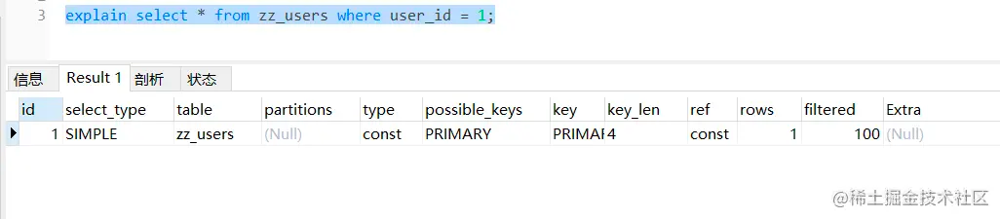​

* id

  * id 越大，执行优先级越高
* select_type

  * SIMPLE

    * 简单的 select 查询语句，不包含 union、子查询语句
  * UNION
  * SUBQUEPY

    * 子查询
* table

  * 数据集，有可能是表名，子查询结果等
* type 显示查询用了哪种类型

  * all

    * 全表扫描
  * index

    * 索引全扫描
  * range

    * 索引范围扫描
  * ref

    * 非主键非唯一索引等值扫描
  * eq_ref

    * 主键索引(primary key)或者非空唯一索引(unique not null)等值扫描
    * a left join b on a.id = b.a_id
  * const

    * 通过索引一趟查找后就能获取到数据，基于唯一、主键索引字段查询数据时的情况
    * where id = 1
  * system

    * 表中只有一行数据，这是 const 的一种特例
* possible_keys

  * 可能用到的索引
* key

  * 具体使用的索引
  * possible_keys 有值，key 为空，多半是数据不多，直接全表扫描
  * possible_keys、key 都为空 未使用索引
* key_len

  * 索引字段长度，判断联合索引，匹配了几个
* ref 显示索引的哪一列被使用了

  * const

    * select ... where 主键字段 = 主键值
  * 具体的字段名

    * 表示目前会基于该字段查询数据
  * func

    * 当前索引字段匹配的值是一个函数
* rows

  * 预计会扫描的行数，不准
* extra

  * Using index

    * 表示查询的列均被索引覆盖，无需回表
  * Using where

    * 表示查询的列未被索引覆盖，所以需要回表读取数据
  * Using temporary

    * 使用临时表，意味着 SQL 语句在执行 order by、group by、union 等操作的过程中，需要临时表来存储中间结果集
  * Using filesort

    * 使用文件排序，意味着 SQL 语句在进行 order by 操作的时候，所对应的列没有用到索引

> * SQL 语句在进行多表关联时，如果使用了非驱动表中的字段进行 order by 操作，就会在 Extra 列中出现 Using temporary 和 Using filesort。
> * 驱动表就是在 SQL 语句执行过程中，优先被读取的表，那非驱动表就是没有被优化读取的表。

### MySQL调优

#### MySQL调优的五个维度

聊到`MySQL`​的性能优化，其实也可以从多个维度出发，共计优化项如下：

* ①客户端与连接层的优化：调整客户端`DB`​连接池的参数和`DB`​连接层的参数。
* ②`MySQL`​结构的优化：合理的设计库表结构，表中字段根据业务选择合适的数据类型、索引。
* ③`MySQL`​参数优化：调整参数的默认值，根据业务将各类参数调整到合适的大小。
* ④整体架构优化：引入中间件减轻数据库压力，优化`MySQL`​架构提高可用性。
* ⑤编码层优化：根据库表结构、索引结构优化业务`SQL`​语句，提高索引命中率。

#### MySQL连接层优化策略

> 数据库连接数越大，也就意味着内部创建出的工作线程会越多，线程越多代表需要的`CPU`​配置得更高。

比如现在有`300`​个客户端连接，内部创建了`300`​条工作线程处理，但服务器的`CPU`​仅有`32`​个核心，那当前服务器最多只能支持`32`​条线程同时工作，那其他`268`​条线程怎么办呢？

为了其他线程能够正常执行，`CPU`​就会以时间片调度的模式工作，不同核心在不同线程间反复切换执行，但由于线程数远超核心数，因此会导致线程上下文切换的开销，远大于线程执行的开销。

> 正是由于上述原因，所以数据库的连接数该设置成多少合适呢？这就是一个值得探讨的问题，而连接池又会分为客户端连接池、服务端连接池，客户端连接池是指`Java`​自身维护的数据库连接对象，如`C3P0、DBCP、Druid、HikariCP...`​等连接池。服务端连接池是指`MySQL-Server`​的连接层中，自身维护的一个连接池，用来实现线程复用的目的。

对于`MySQL`​连接池的最大连接数，这点无需咱们关心，重点调整的是客户端连接池的连接数，为啥呢？

因为`MySQL`​实例一般情况下只为单个项目提供服务，你把应用程序那边的连接数做了限制，自然也就限制了服务端的连接数。

但为啥不将`MySQL`​的最大连接数和客户端连接池的最大连接数保持一致呢？

这是由于有可能你的数据库实例不仅仅只为单个项目提供服务，比如你有时候会通过终端工具远程连接`MySQL`​，如果你将两个连接池的连接数保持一致，就很有可能导致`MySQL`​连接数爆满，最终造成终端无法连上`MySQL`​。

> 借鉴一下`PostgreSQL`​提供的计算公式：
>
> **最大连接数 =**   **(CPU核心数 ***  **2) + 有效磁盘数**

“有效磁盘数”，这是个啥？其实是指`SSD`​固态硬盘，如果部署数据库的服务器，其硬盘是`SSD`​类型，那么在发生磁盘`IO`​基本上不会产生阻塞。因为`SSD`​相较于传统的机械硬盘，它并没有的磁片，无需经过旋转磁面的方式寻址，所以`SSD`​硬盘的情况下，可以再`+1`​。

> 比如目前服务器的硬件配置为`CPU：16core`​、硬盘类型：`SSD`​，此时最佳的最大连接数则为`16*2+1=33`​，而常驻连接数可以调整到`30`​左右，这组配置绝对是当前场景下的最佳配置，如若再调大连接数，这反而会让性能更慢，因为会造成线程上下文切换的额外开销。

当然，上述这个公式虽说能够应对绝大部分情况，但实际业务中，还需要考虑`SQL`​的执行时长，比如一类业务的`SQL`​执行只需`10ms`​，而另一类`SQL`​由于业务过为繁琐，每次调用时会产生一个大事务，一次执行下来可能需要`5s+`​，那这两种情况都采用相同的连接池可以吗？

可以是可以，但大事务会影响其他正常的`SQL`​，因此想要完美的解决这类问题，最好再单独开一个连接池，为大事务或执行耗时较长的`SQL`​提供服务。

##### 偶发高峰类业务的连接数配置

类似这样的业务，可以将最大连接数按之前的公式配置，而常驻连接数则可以配成`CPU`​核数`+1`​，同时缩短连接的存活时间，及时释放空闲的数据库连接，以此确保资源的合理分配。

##### 分库分表情况下的连接数配置

对于读写分离、双主双写、分库分表的情况下，就不适合这样配置，毕竟部署了多个`MySQL`​节点，也就意味着拥有多台服务器的硬件资源，因此在数据库部署了多节点的情况下，请记得根据每个节点的硬件配置，来规划出合理的连接数。

##### 连接层调优小结

合理的连接数才是最好的，而并非越大越好。

**对于最佳连接数的计算，首先要把**​**​`CPU`​**​**核数放首位考虑，紧接着是磁盘，最后是网络带宽，因为带宽会影响**​**​`SQL`​**​**执行时间，综合考虑后才能计算出最合适的连接数大小。**

#### MySQL结构的优化方案

所谓的`MySQL`​结构优化，主要是指三方面，即表结构、字段结构以及索引结构，这些结构如果不合理，在某些场景下也会影响数据库的性能。

##### 表结构的优化

①表结构设计时的第一条也是最重要的一条，字段数量一定不要太多。

> ​`InnoDB`​引擎基本上都会将数据操作放到内存中完成，而当一张表的字段数量越多，那么能载入内存的数据页会越少，当操作时数据不在内存，又不得不去磁盘中读取数据，这显然会很大程度上影响`MySQL`​性能。

> 一张表最多最多只能允许设计`30`​个字段左右，否则会导致查询时的性能明显下降。

②主键的选择一定要合适。主键最好是顺序递增的数值类型，最好为`int`​类型。

> 例如学生表中的学号、职工表中的工号....，如果一张表的业务中不带有这类字段，那也可以设计一个与业务无关、无意义的数值序列字段作为主键，因为这样做最适合维护表数据（跟聚簇索引有关）。

③对于实时性要求不高的数据建立中间表。

> 很多时候咱们为了统计一些数据时，通常情况下都会基于多表做联查，以此来确保得到统计所需的数据，但如若对于实时性的要求没那么高，就可以在库中建立相应的中间表，然后每日定期更新中间表的数据，从而达到减小连表查询的开销，同时也能进一步提升查询速度。

④根据业务特性为每张不同的表选择合适的存储引擎。

> 其实存储引擎这块主要是在`InnoDB、MyISAM`​两者之间做抉择，对于一些经常查询，很少发生变更的表，就可以选择`MyISAM`​引擎，比如字典表、标签表、权限表....，因为读远大于写的表中，`MyISAM`​性能表现会更佳，其他的表则可以使用默认的`InnoDB`​引擎。

##### 字段结构的优化

字段结构的优化其实主要指选择合适的数据类型。

> 大多数开发在设计表字段结构时，如果要使用数值类型一般会选择`int`​，使用字符串类型一般会选择`varchar`​，但这些字段类型可以适当的做些调整。
>
> * 对于一些显然不会拥有太多数据的表，主键`ID`​的类型可以从`int`​换成`tinyint、smallint、mediumit`​。
> * 对于一些固定值的字段，如性别、状态、省份、国籍等字段，可以选择使用数值型代替字符串，如果必须使用字符串类型，最好使用`enum`​枚举类型代替`varchar`​类型。
> * 对于姓名字段，一般都会限制用户名长度，这时不要无脑用`varchar`​，使用`char`​类型更好。

总之在选择字段的数据类型时有三个原则：

* ①在保证足够使用的范围内，选择最小数据类型，因为它们会占用更少的磁盘、内存和`CPU`​缓存，同时在处理速度也会更快。
* ②尽量避免索引字段值为`NULL`​，定义字段时应尽可能使用`NOT NULL`​关键字，因为字段空值过多会影响索引性能。
* ③在条件允许的情况下，尽量使用最简单的类型代替复杂的类型，如`IP`​的存储可以使用`int`​而并非`varchar`​，因为简单的数据类型，操作时通常需要的`CPU`​资源更少。

##### 索引结构的优化

索引结构优化主要是指根据业务创建更合适的索引。

* ①索引字段的组成尽量选择多个，如果一个表中需要建立多个索引，应适当根据业务去将多个单列索引组合成一个联合索引，这样做一方面可以节省磁盘空间，第二方面还可以充分使用索引覆盖的方式查询数据，能够在一定程度上提升数据库的整体性能。
* ②对一个值较长的字段建立索引时，可以选用字段值的前`N`​个字符创建索引，也就是对于值较长的字段尽量建立前缀索引，而不是通过完整的字段值建立索引

  * 索引字段值越小，单个`B+Tree`​的节点中能存储的索引键会越多，一个节点存下的索引键越多，索引树会越矮，查询性能自然会越高。
* ③索引类型的选择一定要合理，对于经常做模糊查询的字段，可以建立全文索引来代替普通索引，因为基于普通索引做`like`​查询会导致索引失效，而采用全文索引的方式做模糊查询效率会更高更快，并且全文索引的功能更为强大。
* ④索引结构的选择可以根据业务进行调整，在某些不会做范围查询的字段上建立索引时，可以选用`hash`​结构代替`B+Tree`​结构，因为`Hash`​结构的索引是所有数据结构中最快的，散列度足够的情况下，复杂度仅为`O(1)`​。

#### MySQL参数优化的选项

##### 调整InnoDB缓冲区

在`MySQL`​参数中，首先最值得调整的就是`InnoDB`​缓冲区的大小，因为`InnoDB`​将是`MySQL`​启动后使用最多的引擎，所以为其分配一个足够大的缓冲区，能够在最大程度上提升`MySQL`​的性能，但是缓冲区该分配多少内存呢？

> 最佳比例应该控制在`70~75%`​左右，比如一台服务器的内存为`32GB`​，将`innodb_buffer_pool_size = 22938M（23GB）`​左右最合理。

同时当`InnoDB`​缓冲区空间大于`1GB`​时，`InnoDB`​会自动将缓冲区划分为多个实例空间，这样做的好处在于：**多线程并发执行时，可以减少并发冲突**。`MySQL`​官方的建议是每个缓冲区实例必须大于`1GB`​，因此如果机器内存较小时，例如`8/16GB`​，可以指定为`1GB`​，但是机器内存够大时，比如达到了`32GB/64GB`​甚至更高，哪可以适当将每个缓冲区实例调整到`2GB`​左右。

> 比如现在假设缓冲区共计拥有`40GB`​内存，哪设置将缓冲区实例设置为`innodb_buffer_pool_instances = 20`​个比较合适。

##### 调整工作线程的缓冲区

这几个区域属于线程私有区域，也就意味着每条线程都拥有这些区域：

* ​`sort_buffer_size`​：排序缓冲区大小，影响`group by、order by...`​等排序操作。
* ​`read_buffer_size`​：读取缓冲区大小，影响`select...`​查询操作的性能。
* ​`join_buffer_size`​：联查缓冲区大小，影响`join`​多表联查的性能。

> 对于这些区域，最好根据机器内存来设置为一到两倍`MB`​，啥意思呢？比如`4GB`​的内存，建议将其调整为`4/8MB`​、`8GB`​的内存，建议将其调整为`8/16MB.....`​，但这些区域的大小最好控制在`64MB`​以下，因为线程每次执行完一条`SQL`​后，就会将这些区域释放，所以再调大也没有必要了。

##### 调整临时表空间

同时还可以调整`tmp_table_size、max_heap_table_size`​两个参数，这两个参数主要是限制临时表可用的内存空间，当创建的临时表空间占用超过`tmp_table_size`​时，就会将其他新创建的临时表转到磁盘中创建，这显然是十分违背临时表的设计初衷，毕竟创建临时表的目的就是用来加快查询速度，结果又最后又把临时表放到磁盘中去了，这反而还多了一步开销。

> 那么这两个参数该设置多大呢？这要根据`show global status like 'created_tmp%';`​的统计信息来决定，用统计出来的信息：`Created_tmp_disk_tables / Created_tmp_tables * 100% = 120%`​，达到这个标准就比较合适，但调整这个区域的值需要反复重启`MySQL`​以及压测，因此比较费时间，如果你在项目中很少使用临时表，哪也可以不关心这块参数的调整。

#### 架构优化

##### 引入缓存中间件解决读压力

正常的项目业务中，往往读请求的数量远超写请求，如果将所有的读请求都落入数据库处理，这自然会对`MySQL`​造成巨大的访问压力，严重的情况下甚至会由于流量过大，直接将数据库打到宕机，因此为了解决这系列问题，通常都会在应用程序和数据库之间架设一个缓存，例如最常用的`Redis`​。

​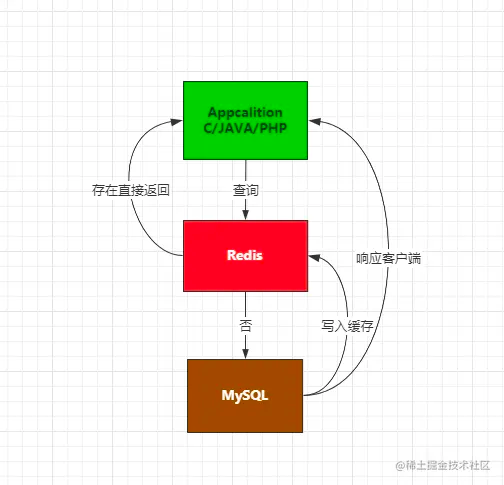​

在项目中引入`Redis`​作为缓存后，在缓存`Key`​设计合理的情况下，至少能够为`MySQL`​分担`70%`​以上的读压力，查询`MySQL`​之前先查询一次`Redis`​，`Redis`​中有缓存数据则直接返回，没有数据时再将请求交给`MySQL`​处理，从`MySQL`​查询到数据后，再次将数据写入`Redis`​，后续有相同请求再来读取数据时，直接从`Redis`​返回数据即可。

##### 引入消息中间件解决写压力

前面项目中引入`Redis`​后，能够在很大程度上减轻`MySQL`​的读请求压力，但当业务系统中的写操作也较为频繁时又该怎么办呢？`Redis`​在这里似乎只能分担读操作的流量呀？这时就可以引入`MQ`​消息中间件做削峰填谷。

​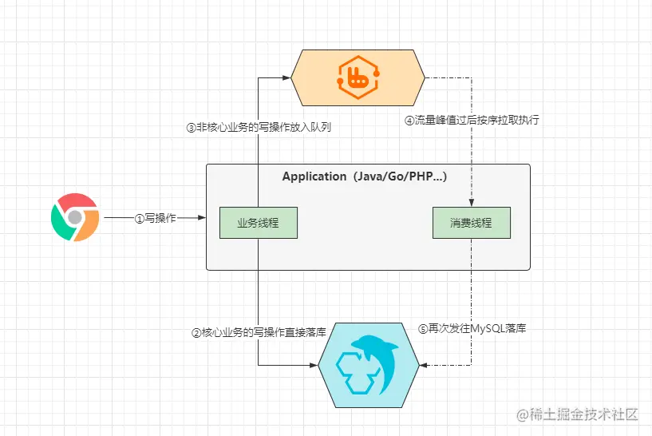​

经过`MQ`​做了流量的削峰填谷后，这能够在极大的程度上减轻`MySQL`​的写压力，能够将写压力控制到一个相较平缓的程度，防止由于大量写请求直接到达`MySQL`​，避免负载过高造成的宕机现象出现。

##### MySQL主从读写分离

​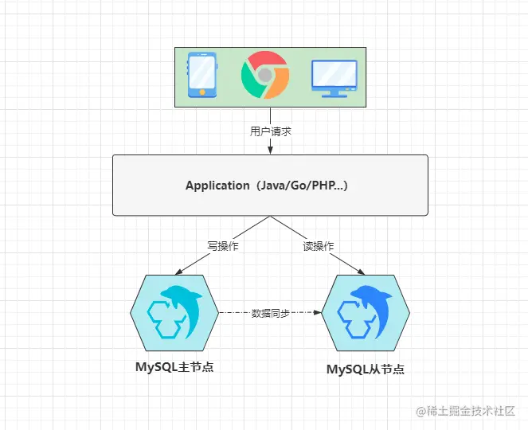​

实现读写分离，由于读操作并不会变更数据，所以对于读请求可以分发到从节点上处理，对于会引发数据变更的写请求，则分发到主节点处理，这样从而能够进一步提升`MySQL`​的整体性能。

主从读写分离的方案，更适用于一些读大于写的业务。

##### MySQL双主双写热备

对于一些类似于仓储这种写大于读的项目业务，这种方案带来的性能收益不见得有多好，因此从机分担的读压力，可能仅是系统的`10~20%`​流量，因此对于这种场景下，双主双写（双主热备）方案才是最佳选择，其架构图如下：

​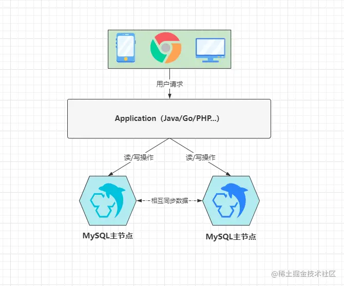​

这里的两个`MySQL`​节点都为主，同时它们也都为从，啥意思呢？其实就是指这两个节点互为主从，两者之间相互同步数据，同时都具备处理读/写请求的能力，当出现数据库的读/写操作时，可以将请求抛给其中任意一个节点处理。

> 为了兼容两者之间的数据，对于每张表的主键要处理好，如果表的主键是`int`​自增类型的，请一定要手动设置一下自增步长和起始值，比如这里有两个`MySQL`​节点，那么可以将步长设置为`2`​，起始值分别为`1、2`​，这样做的好处是啥？能够确保主键的唯一性，设置后两个节点自增`ID`​的序列如下：
>
> * 节点`1`​：`[1、3、5、7、9、11、13、15、17、19.....]`​
> * 节点`2`​：`[2、4、6、8、10、12、14、16、18、20.....]`​

当插入数据的`SQL`​语句发往节点`1`​时，会按照奇数序列自增`ID`​，发往节点`2`​时会以偶数序列自增`ID`​，然后双方相互同步数据，最终两个`MySQL`​节点都会具备完整的数据，因此后续的读请求，无论发往哪个节点都可以读到数据。

> 有人或许会思考，既然两个节点互为主从可以实现双主双写，哪能不能搞三个节点、四个节点呢？答案是当然可以，不过没必要这么做，因为当需要上三主、四主....的项目，直接就做分库分表更实在，因为这种多主模式存在一个天大的弊端！！

##### MySQL分库分表思想

多主模式有一个天大的弊端！这个弊端是指`存储容量的上限`​+`木桶效应`​，因为多主模式中的每个节点都会存储完整的数据，因此当数据增长达到硬件的最大容量时，就无法继续写入数据了，此时只能通过加大磁盘的形式进一步提高存储容量，但硬件也不可能无限制的加下去，而且由于多主是基于主从架构实现的，因为具备`木桶效应`​，要加得所有节点一起加，否则另一个节点无法同步写入数据时，就会造成所有节点无法写入数据。

​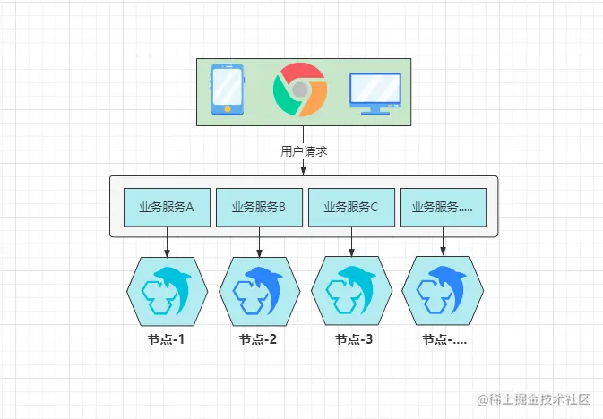​

#### SQL优化

##### 分页优化

* 根据自增且连续主键排序的分页查询

```sql
select * from t1 limit 99000,2;
```

  =>

```sql
select * from t1 where id >99000 limit 2;
```

* 查询根据非主键字段排序的分页查询（`延迟关联`​）

```sql
select  from t1 order by a limit 99000,2;  
```

‍

  =>

```sql
SELECT  FROM t1 f INNER JOIN (SELECT id FROM t1 ORDER BY a LIMIT 99000, 2) g ON f.id = g.id;
```

##### Join 语句优化

```sql
select * from A left join B ON A.id = B.id
```

###### 简单嵌套循环连接（NLJ 算法）

算法很简单，从表A中取出一条数据1，遍历表B，将匹配到的数据放到result中...以此类推，驱动表A中的每一条记录与被驱动表B的记录进行判断：

​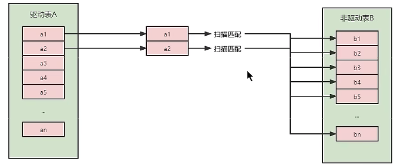​

这种方式效率非常低，表A数据100条，表B数据1000条计算的话，则A*B=10w次。

###### 被驱动表加索引 (Index NLJ算法）

优化思路：**减少内层表数据的匹配次数**，所以被驱动表必须加上索引。这样，通过外层表匹配条件直接与内层表索引进行匹配，避免和内层表每条记录去比较，极大减少了对内层表的匹配次数。

​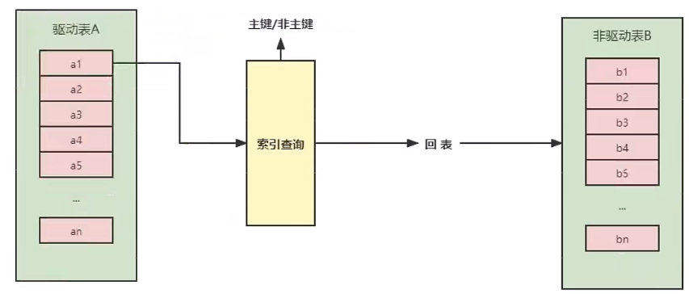​

###### 块嵌套循环连接（BNL 算法）

优化思路：不再逐条获取驱动表的数据，而是一块一块的获取，引入了`join buffer缓冲区`​，将驱动表join相关的部分数据列（大小受join buffer的限制）缓存到 join buffer中，然后再全表扫描被驱动表，被驱动表的每一条记录一次性和join buffer中所有的驱动表记录进行匹配（内存中操作），将简单嵌套循环中的多次比较合并成一次，降低了被驱动表访问频率。

> 注意：这里缓存的不只是关联表的列，select后面的列也会被缓存起来
>
> 在一个有N个join关联的sql中，会分配N-1个join buffer。
>
> 所以查询的时候，尽量减少不必要的字段，可以让join buffer中可以存放更多的列。

​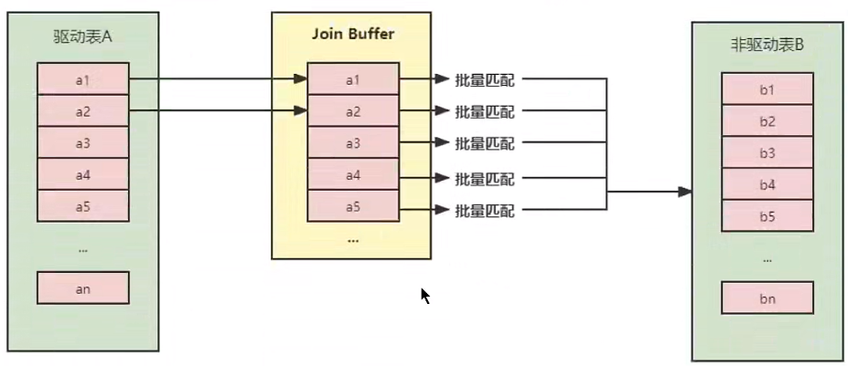​

###### 总结

* 永远用小结果集驱动大结果集（本质就是减少外层循环的数据数量）
* 为被驱动表匹配的条件，增加索引（减少内层表的循环匹配次数）
* 适当增大`join buffer`​大小（一次性缓存的数据越多，那么内层扫描次数就越少）
* 减少驱动表不必要的字段查询（字段越少，join buffer所缓存的数据就越多）

##### 子查询优化

子查询执行效率不高的原因：

1. 执行子查询时，InnoDb需要为内层查询语句的查询结果，`建立一张临时表`​，然后外层查询语句从临时表中查询记录。查询完后，再`撤销这些临时表`​。这样会消耗过多的CPU和IO资源
2. 子查询的结果集都放到了临时表，不管是内存临时表还是磁盘临时表，都`不会存在索引`​，所以查询性能会受到影响。

优化思路：

可以尝试用 `join`​查询来替代子查询。连接查询不需要建立临时表，如果关联条件都用上了索引的话，性能会比较好。

##### 其他查询优化策略

###### in 和 exists

```sql
select * from A  where id in (select id from B)
select * from A where exists (select id from B where B.id = A.id)
```

* （1） 使用上的区别：exists 中放一个子查询有记录返回 true，无记录返回 false（NULL 也算有记录），in 中查询结果集只能有一个字
* （2） 性能上的区别：in 要把缓存到内存中，exists 不需要缓存结果

  * in()适合 B 表比 A 表数据小的情况
  * exists()适合 B 表比 A 表数据大的情况
* 当 A 表数据与 B 表数据一样大时,in 与 exists 效率差不多,可任选一个使用

> 在这个查询中，驱动表（也称为外层表或主表）通常是指被最外层查询首先访问的表，而被驱动表（也称为内层表或从表）是嵌套查询中涉及的表。
>
> 根据这个查询：
>
> * 驱动表是A，因为查询从表A开始，试图找到满足条件的行。
> * 被驱动表是B，因为它的数据被用来确定哪些行应该从表A中检索。

当 A < B 时，用 `exists()`​，因为 `exists()`​的实现，相当于外表循环，实现逻辑类似于：

```java
for i in A
	for j in B
		if j.id == i.id then ...
```

当 A > B 时，用 `in()`​，因为 `in()`​的实现，实现逻辑类似于：

```java
for i in B
	for j in A
		if j.id == i.id then ...
```

###### LIMIT 1 对优化的影响

如果确定结果集只有一条，那就加上limit 1，加快查询速度

###### where + order by 建立联合索引

###### where 优于 having

​​

where 效率高于 having，能写在where限定的条件，就不要写在having中

### 分库分表

**总体来说：性能出现瓶颈，并且其他优化手段无法很好的解决问题。**

* 单表出现瓶颈：

  * **单表数据量较大，导致读写性能较慢**
* 单库出现瓶颈

  * **CPU压力过大(busy，load过高)，导致读写性能较慢**
  * **内存不足(缓存池命中率较低、磁盘读写IOPS过高)，导致读写性能较慢**
  * **磁盘空间不足**，导致无法正常写入数据
  * **网络带宽不足**，导致读写性能较慢

#### 数据量超过多少应该分库分表？

* 看对应业务复杂情况，如果是表字段较为简单，即使数据量超过亿级，整体读写性能也较好，不用分表；
* 如果表比较复杂，可能即使数据量超过百万，读写性能就达到瓶颈。

#### 如何选择分库分表

* 只分表：

  * 单表数据量较大，单表读写性能出现瓶颈
  * 数据量太大的话，SQL的查询就会变慢（2000w级别数据，需要3次IO，层数越多越慢）

* 只分库：

  * 就是一个数据库分成多个数据库，部署到不同机器
  * ​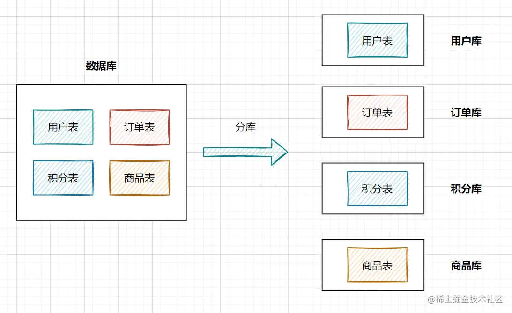​
  * 业务量剧增，MySQL单机磁盘容量会撑爆，拆成多个数据库，磁盘使用率大大降低
  * 数据库连接是有限的。在高并发的场景下，大量请求访问数据库，MySQL单机是扛不住的，将单个数据库拆成多个库（**订单库、用户库、商品库**），以分担读写压力

* 分库分表

  * ​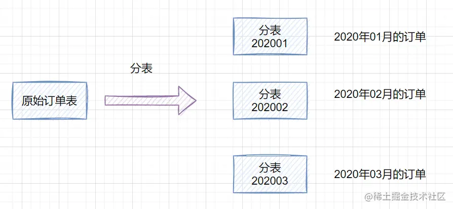​
  * 单表数据量较大，单表读写性能出现瓶颈；
  * 数据库(读）写压力较大，数据库出现存储性能瓶颈

#### 分表

* 垂直分表

  * 以字段为依据，按照字段的活跃性，将表中字段拆到不同的表(主表和扩展表)中
  * 拆字段
* 水平分表

  * 结构相同，数据不同
  * 比如根据时间

#### 分库

* 垂直分库

  * 以表为依据，按照业务归属不同，将不同的表拆分到不同的库中
  * 拆成用户库，平台库等
* 水平分库

  * 结构相同，数据不同
  * 根据时间

#### 挑战点

##### 水平拆分策略

水分拆分需要考虑的因素有三个：

* **查询操作中的路由因素**；
* **插入操作中的热点分散因素**；
* **技术方案的复杂度因素**。

并且，这三种因素间是一种**零和关系**，两方所得必为一方所失，这无疑为选择和取舍增加了难度。

基于如上三种因素考虑，共有四种水平拆分策略，即：`Range 拆分`​、`Hash 取模拆分`​、`Hash 取模 + Range 拆分`​和 `Hash 取模 + 映射表拆分`​。

###### Range 拆分

最常见的就是以`日期`​作为 Sharding Key（分片键），进行 Range 拆分。

图例如下：

​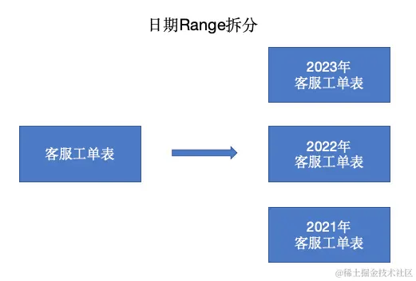​

* 优点：非常适合于存储**冷热分明的业务数据**，几乎所有查询操作全部在热数据表中完成，而冷数据则是以半归档的方式进行存储。
* 缺点：热点数据全部集中在一张表中，在高并发的场景下容易产生性能瓶颈。

###### Hash 取模拆分

最常见的就是以 `ID`​ 作为 Sharding Key，通过取模的方式拆分，如：主键 ID、用户 ID、商家 ID、课程 ID 等。

图例如下：

​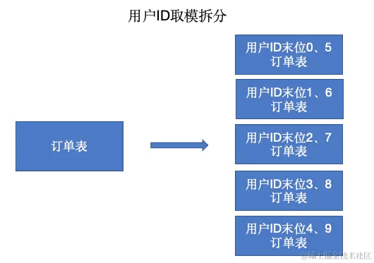​

* 优点：无论是分库还是分表，热点数据都已经全部散开，可以从容应对高并发的场景，不会产生性能瓶颈。
* 缺点：对非 Sharding Key 的查询操作不友好，只能将所有库表全部查询一遍，然后再进行多路归并的方式返回结果。而且扩容时，还需要 **数据迁移**

###### Hash 取模 + Range 拆分

最常见的就是：先以 ID 作为 Sharding Key，通过取模的方式进行首次拆分；然后再以日期作为 Sharding Key，进行 Range 二次拆分。其实就是上述两种方案的的结合体。

图例如下：

​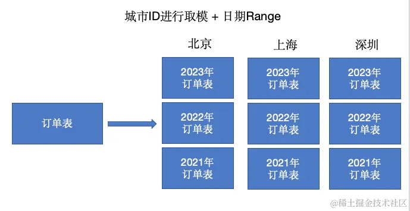​

优点：

* 取模拆分的方式，无论是分库还是分表，热点数据都已经全部散开，可以从容应对高并发的场景，不会产生性能瓶颈。
* Range 拆分的方式，使单表数据量级得到很好的控制，而不是随着时间的推移，表中的数据越累积越多。

缺点：

* 对非 Sharding Key 的查询操作不友好，只能将所有库表全部查询一遍，然后再进行多路归并的方式返回结果。
* 相较而言，方案过于复杂。

###### Hash 取模 + 映射表拆分

最常见的就是以 ID 作为 Sharding Key，通过取模的方式拆分，然后再通过映射表的方式进行辅助查询。

图例如下：

​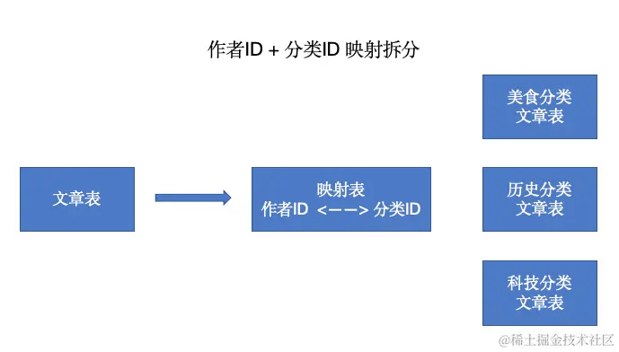​

优点：

* 无论是分库还是分表，热点数据都已经全部散开，可以从容应对高并发的场景，不会产生性能瓶颈。
* 通过映射表辅助的方式，可以灵活地构建一对多的查询关系，并且只需要根据映射表关系查询目标库表即可，不需要所有库表全部查询一遍。

缺点：

* 对非 Sharding Key 的查询操作不友好，只能将所有库表全部查询一遍，然后再进行多路归并的方式返回结果。
* 方案过于复杂，且映射表数据量过大，也需要考虑分库分表的可能性。

##### 容量预估的前瞻性

我们希望把分库分表的策略一次性做到位，让其至少可承载未来五年的数据量级，而不是由于容量预估不足，导致时隔一年半载地再重来一遍。

因此，在容量预估上，我们不能局限在线性思维中，认为今年业务主表的数据量是 5000 万，那么明年还是 5000 万，而是要把业务增量也考虑进去，这样才算是具备前瞻性的容量预估。

#### 大型电商订单数据，分表分库案例

##### 背景

某大型电商平台的业务增长迅猛，日订单量已经由两个月前的 5 万单增长到了 30 万单，订单表中的数据已经达到了 6000 多万。按照业务团队的增量计算方式，三个月后日订单量会达到 50 万。

因此，给订单表制定分库分表方案，则成为当前技术团队最重要且紧急的事情。

由于订单数据并没有非常明显的冷热字段和大字段，所以并不需要考虑垂直拆分，只需要考虑进行水平拆分即可。

按照未来 5 年日订单稳定在 100 万来预估，一年有将近 4 亿的订单数据，5 年是 20 亿，正好可以分为 10 个库，每个库有 10 张表，单表在 5 年后达到 2000 万数据。

##### 1. 订单 ID 作为 Sharding Key

通过订单 ID 作为 Sharding Key 进行分库分表，其中，以订单 ID 的最后一位数字取模进行分库，以倒数第二位取模进行分表。

如下图所示：

​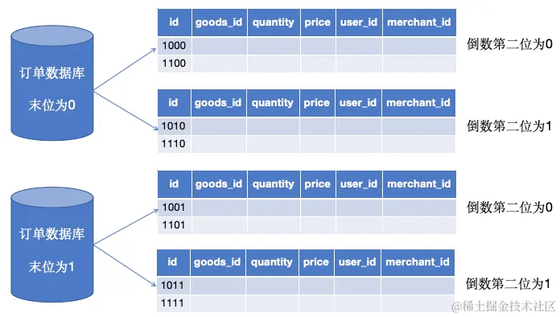​

这个方案的优点是，按照订单 ID 进行分库分表，每个库表中的数据会分散得非常均匀，且热点数据全部散开，不会出现一个数据库读写压力过大导致性能瓶颈，其他数据库却出现资源闲置的情况。

但这个方案很快就被否定了，因为根据订单中心的请求日志分析，大概 55% 的订单查询请求都是根据用户 ID（user_id）进行查询的，而根据订单 ID 进行查询的请求只有 20%。

相当于如果根据订单 ID 进行分表，那么 55% 的根据用户 ID 进行查询的请求需要进行跨库查询，这显然是不行的。

##### 2. 用户 ID 作为 Sharding Key

既然根据用户 ID 进行查询的请求比例这么高，那索性换个思路，通过用户 ID 作为 Sharding Key 进行分库分表吧。其中，以用户 ID 的最后一位数字取模进行分库，以倒数第二位取模进行分表。

如下图所示：

​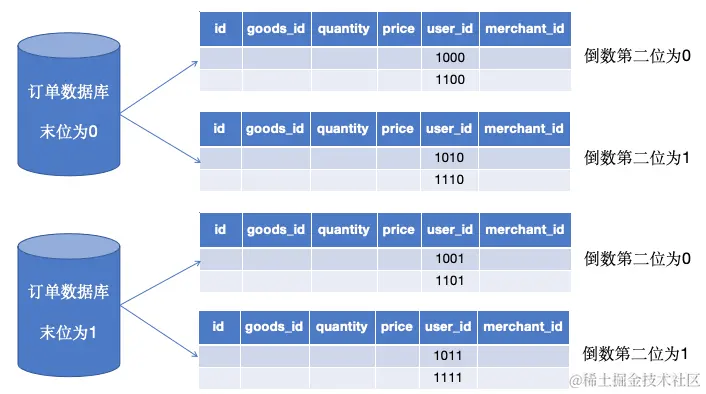​

这个方案的优点是，通过用户 ID 作为 Sharding Key 进行分库分表，55% 根据用户 ID 进行查询的请求不需要进行跨库查询了。

并且，在用户量级足够多的情况下，每个库表中的数据仍然会分散得非常均匀，且热点数据全部散开，不会出现一个数据库读写压力过大导致性能瓶颈，其他数据库却出现资源闲置的情况。

但问题的影响比例只是被缩小了一些，却依然是存在的，那就是还会有 45% 的查询请求需要跨库查询。

有的同事建议，直接用多堆从库的方式去硬扛剩下的 45% 流量，但立即被否定了。因为无论是查询性能角度，还是硬件成本角度，都存在问题。

我们思考一下，有没有一种方案，既支持以不跨库的方式根据用户 ID 进行查询，也支持以不跨库的方式根据订单 ID 进行查询呢？

##### 3. 用户 ID 作为 Sharding Key + 映射表

当然是有的！“用户 ID 作为 Sharding Key + 映射表”，就是“不跨库根据用户 ID 查询 + 不跨库根据订单 ID 查询”的一种方案。

当我们在创建订单的时候，同时将订单 ID 和用户 ID 的对应关系写入映射表中，这样根据订单 ID 进行查询的时候，就可以先到映射表中查询到用户 ID，再通过用户 ID + 订单 ID 查询到对应的订单数据。

​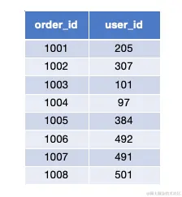​

这个技术方案的优点是简单清晰，开发工作量小，缺点是需要多进行一次映射表查询，且映射表的存储也是一种开销。另外，映射表数据量过大，也需要进行分库分表。

##### 4. 用户 ID 作为 Sharding Key + 路由键

“用户 ID 作为 Sharding Key + 路由键”，则是“不跨库根据用户 ID 查询 + 不跨库根据订单 ID 查询”的另一种方案。

这种方案的实现方式是，将路由键作为订单 ID 的一部分，这样就不需要存储订单 ID 和用户 ID 对应关系的映射表了。

按照我们的这个业务场景，订单 ID 的算法如下：

* 订单 ID = 雪花算法生成的 ID + 用户 ID 的后两位

如上文所述，我们“通过用户 ID 作为 Sharding Key” 分了 10 个库，每个库有 10 张表，算起来正好是 100 张表，后两位（00～99）恰好够了。

​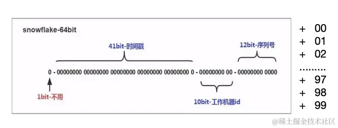​

需要注意的是，以这种方式生成的订单 ID，MySQL 中的 bigint 数据类型已经存不下了，需要用 decimal(21) 来进行存储。

BTW：方案 3、4 确实有效地解决了“不跨库根据用户 ID 查询 + 不跨库根据订单 ID 查询”的问题，还有 20% 的订单查询请求是根据商家 ID（merchant_id）进行查询的，这该如何解决呢？

##### 5. 多 Sharding Key 分库分表

阿里的订单中心是采用三个 Sharding Key（订单 ID、用户 ID、商家 ID）分库分表实现的，且每个 Sharding Key 所对应的库表都是订单的全量数据。

​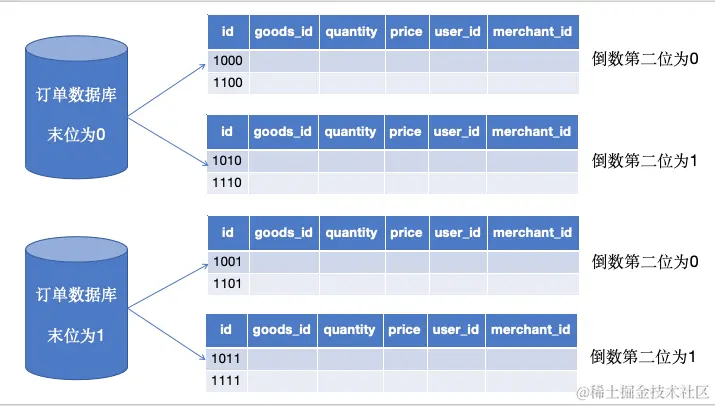​

​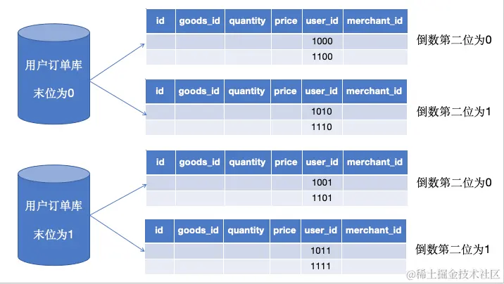​

​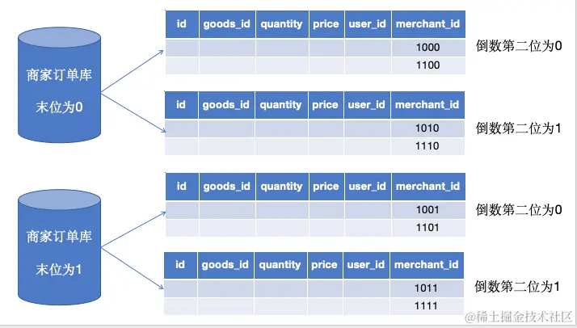​

这种方式的优点是，不像上文所讲的映射表那样，需要进行二次查询，在性能上是有所提升的。缺点则是，需要耗费更多的存储空间进行冗余数据存储。

另外，这种方案如果通过程序控制，进行多个库的数据写入和修改就不合适了，最好通过 Binlog 同步工具 Canal 或 DataBus 去进行多个库的数据同步。

​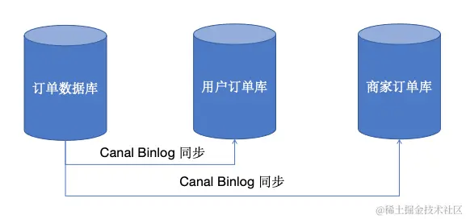​

##### 6. 多 Sharding Key 分库分表 + ElasticSearch

剩下 5% 的订单查询请求是最难解决了，比如：在客服中心系统中，客服人员在进行订单查询的时候，查询项会有十几个，各种查询维度组合多种多样，甚至还需要通过产品关键字进行模糊查询。

这种情况，别说是已经分库分表了，就算在单表中加联合索引都未必能解决问题。这时，我们的订单系统就需要引入 ElasticSearch 了。

相比较于 MySQL 的 B+ Tree 索引，ElasticSearch 的分词器 + 倒排索引机制，更加适合多维复杂查询和全文检索关键字的场景。

​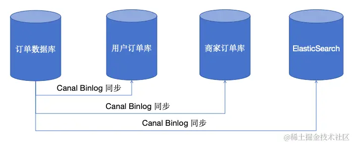​

最终，技术团队选择了方案 6——“**​`多 Sharding Key 分库分表 + ElasticSearch`​**​ ”，作为未来五年订单数据的分库分表方案，也是订单中心系统最为核心的架构设计。

#### 十亿级商品数据，分库分表核心流程详解

##### **目标评估**

* **评估：拆成几个库、几个表**
* **目标：读写能力提升2倍、负载降低30%，容量要支持未来3年的发展**
* 举例：当前2亿，3年后评估为10亿。**分8个表？ 分16个库？**
* 解答：**一个合理的答案，128个表，16个库。按128个表算，拆分完单表156万，3年后为781万**

##### **切分策略**

###### **范围切分**

* 优点：天然水平扩展；单表大小可控
* 缺点：**热点数据一般为新增数据，存在明显的写偏移**
* 适用场景：数据归档

​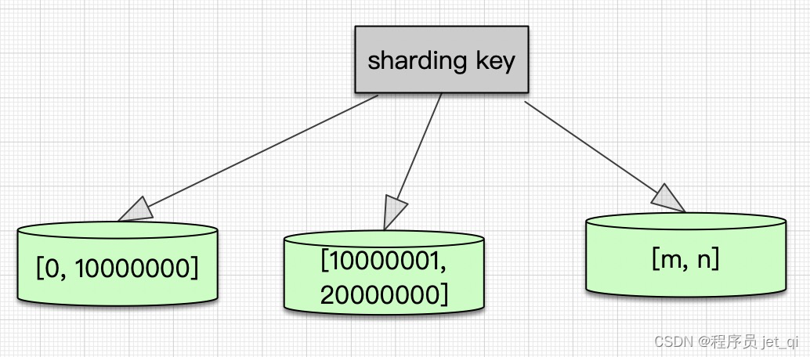​

###### **中间表映射**

* 优点：灵活；
* 缺点：**引入了额外的单点，增加了流程复杂度**。

​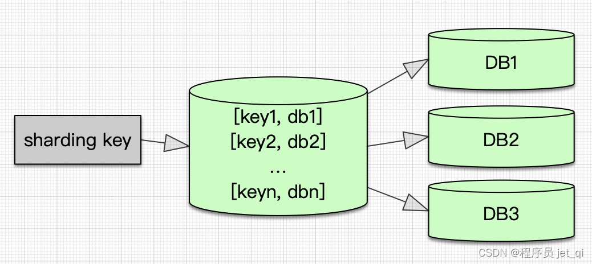​

###### **hash切分**

* 优点：数据分片比较均匀，不容易出现热点和并发访问的瓶颈；
* 缺点：**后续扩容需要迁移数据、存在跨节点查询等问题**；
* **适用场景：大部分场景下都能适用。**

​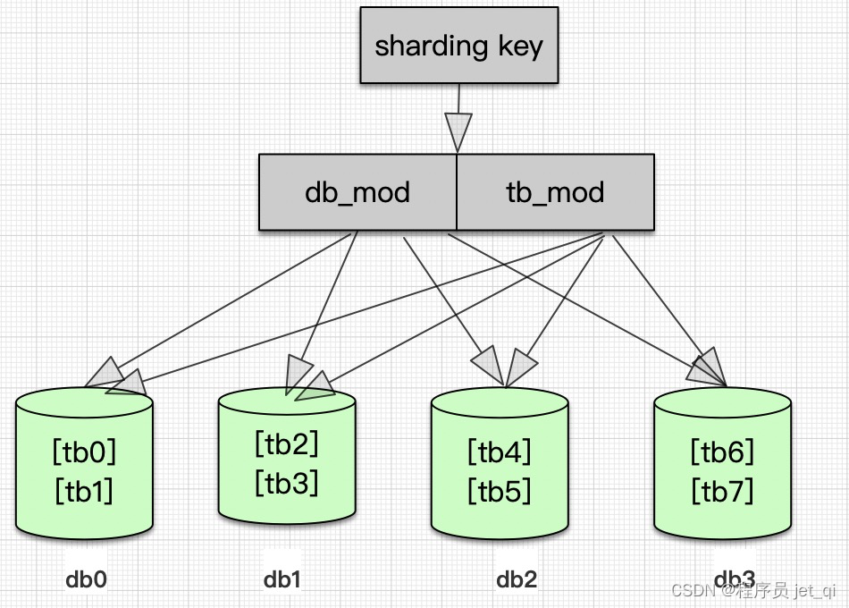​

##### **资源准备、代码改造**

* 代码改造：

  * 写入：单写老库、双写、单写新库
  * 读取：读老、读新、部分读老部分读新
  * 灰度：指定门店灰度、比例灰度

* **常见的双写方案**

  * **作用：保证增量数据在新库和老库都存在**
  * **方案：**

    * 同步双写：同步写新库和老库
    * 异步双写：写老库，监听binlog 异步同步到新表
    * 中间件同步工具：通过一定的规则将数据同步到目标库表

* 实现方案：

  * 底层通过AOP方式实现，不会修改全部写逻辑

##### **数据一致性校验、优化、补偿**

* 作用：确保新库数据正确，达到切读标准、检查是否存在改造遗漏点
* 方案：增量数据校验、全量数据校验、人工抽检
* 核心流程：

  * 读取老库数据
  * 读取新库数据
  * 比较新老库数据 **，一致则继续比较下一条数据**

* 不一致则进行补偿：

  * 新库存在，老库不存在：新库删除数据
  * 新库不存在，老库存在：新库增加数据
  * 新库存在，老库存在：比较所有字段，不一致则将新库更新为老库数据

##### **灰度切读**

* **作用：开始将读流量切到新库**
* 原则：

  * 有问题及时切回老库
  * 灰度放量先慢后快，每次放量观察一段时间
  * 支持灵活的规则：门店维度灰度、百分比灰度

##### 反向双写

双写切新库单写这一步不可逆的主要原因是，一旦切为新库单写，旧库的数据就和新库不一致了，这时候就没法再切回旧库了。

所以，问题的关键是，**切到新库单写后，需要保证旧库的数据和新库保持同步**。那我们的双写就要增加一种过渡状态：就是**从双写以旧库为准，过渡到双写以新库为准**。然后把比对和补偿程序反过来，用新库的数据补偿旧库的数据。这样就可以做到，一旦出问题，再切回到旧库上了。

##### 真正切换

* **停写老库** 一到二周后
* 原则：确认老库数据源全部迁移后，停写老库
* 至此，核心拆分流程结束，后续逐步将老数据库资源逐渐下线。

#### 遇到的问题

##### 分布式id：分库分表后，保证id的唯一性(要保证单调递增)

* **解决方案1：UUID**
* 优点：

  * 本地生成，性能高
* 缺点：

  * 更占用存储空间，一般为长度36的字符串
  * 不适合作为MySQL主键

    * 无序性会导致磁盘随机IO、叶分裂等问题
    * 普通索引需要存储主键值，导致B+树“变高”，IO次数变多
  * 基于MAC地址生成的算法可能导致MAC地址泄漏

* **方案2：雪花算法**

​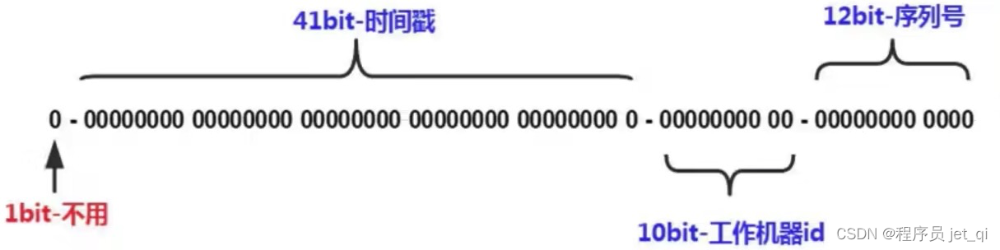​

* **方案3：设置数据库自增起始值和步长，不同节点 id 交叉增长**
* **方案4：第三方中间件，redis incr**

##### 分布式事务

##### 跨库join / 分页查询问题

* **方案1：本地实现**

  * 跨节点 Join 的问题

* 可以分两次查询实现

* 跨节点的聚合函数问题

  * count,order by,group by
  * 分别在各个节点上得到结果后在应用程序端进行合并

‍

* **方案2：使用搜索引擎支持ES**

  * 数据冗余到ES，使用ES支持**复杂查询**
  * 核心流程：

    * 使用ES查询出关键字段，例如：店铺id和商品id
    * 再使用关键字段去数据库查询完整数据
  * **作用类似二级索引**
  * 注意点

    * ES只存储需要搜索的字段

‍
